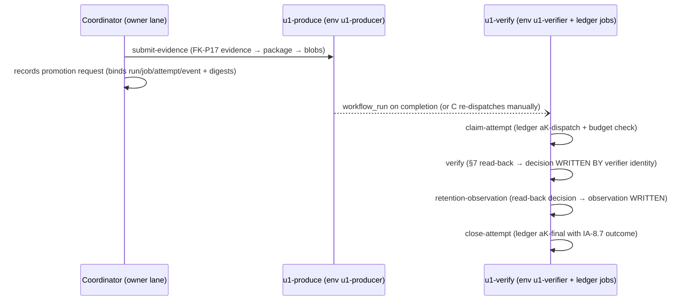

# U1 verifier + producer workflow design — 2026-09-30

**Status: DESIGN ARTIFACT FOR OWNER REVIEW — amended in place 2026-09-30 (coordinator
rulings OQ-6.1…OQ-6.12 incorporated; the authorized IA-3/IA-8/IA-9 amendment is carried in
§10).** This document designs the two GitHub workflows demanded by the U1 evidence contract
(`U1-contract-2026-09-29.md`, committed-bytes SHA-256
`8d5f849cf22f6662f17c2502142e354d82f8f5604d64b511250abc72157df9d5`) and the provisioned
Azure reality (`U1-observations-2026-09-30.md`). It **places nothing**: there are no
`.github/` writes, no Azure or GitHub configuration changes, and no workflow runs here. The
two YAMLs in §4/§5 are fenced content, ready for the owner to place at FK-P18′ dispatch
after (a) the §8 independent review of the U1 contract completes with a reasoned ACCEPT and
(b) the GitHub protection checklist in §6 is enacted (plus the coordinator's custom-role
provisioning, §6.6). Nothing in this document is that review, and nothing here claims
enforcement, promotion, or evidence genuineness (contract §9.1, D13). The workflows
themselves make no ACCEPT possible while any §5 `INCOMPLETE` field of the contract remains
unrecorded (§7.7 of the contract, implemented in both YAMLs).

Audience: the goal owner (protection checklist, §8 dispositions), the control custodian
(INCOMPLETE-U1-14; pin administration §6.4), the FK-P18′ builder (workflow placement and
evidence production), and the §8 independent reviewer (this document is review input, not a
review).

## 1. Scope, lanes, and terminology

- **Producer lane** = `u1-produce.yml`, GitHub environment `u1-producer` (unattended, ruled
  OQ-6.7), Entra identity `u1-producer-mi` (Storage Blob Data Contributor on `u1-evidence`).
  It packages and submits FK-P17-shaped evidence and writes the attempt-ledger rows (durable
  clock). It **never** produces, transports, or persists a verification decision (OQ-6.2).
- **Verifier lane** = `u1-verify.yml`, GitHub environment `u1-verifier` (ATTENDED — required
  reviewers; the human gate sits at the verification decision, never at evidence
  submission), Entra identity `u1-verifier-mi`: **read (Storage Blob Data Reader) +
  create-only write on the decision/observation prefixes only** (custom role
  `u1-verifier-evidence-creator`, §6.6, ruling OQ-6.2 — the stored decision's authorship is
  the verifier identity itself). The `candidate-sandbox` job holds NO credentials.
- **Attempt** (IA-8, contract §3.6) = one verification attempt under one promotion request;
  one `u1-verify` run is one attempt (claim → verify → retention-observation → close). The
  budget (3 attempts / 24 h from `firstAttemptUtc`, 30 min per attempt) governs these
  attempts, not the producer run. The producer run is the evidence execution a promotion
  request later selects.
- **Package** = the run-qualified object set in `u1-evidence` per IA-3/IA-9; **ledger** =
  the `attempt-ledger/` prefix family (IA-8 two-phase rows, §10).

## 2. Pinned inputs (committed-bytes SHA-256)

Pin rule (FK-P17, carried): every pin binds **committed bytes**; uncommitted sibling state is
never pinnable; a pin change is an amendment (standing constraint #34), never a silent
re-anchor. All digests below were recomputed from the file bytes on 2026-09-30 and
cross-checked against the pins already recorded in the contract §1.2 / PIN tables; every
recorded pin reproduced **byte-exact**, which confirms the working tree here equals the
committed state for those files.

| Ref | Cited file (repo-relative) | SHA-256 | Basis |
|---|---|---|---|
| WPIN-01 | `plugins/foreman-line/docs/goals/foreman-kernel/U1-contract-2026-09-29.md` | `8d5f849cf22f6662f17c2502142e354d82f8f5604d64b511250abc72157df9d5` | matches the contract's own cited digest `8d5f849c…` |
| WPIN-02 | `plugins/foreman-line/docs/goals/foreman-kernel/U1-contract-selections-2026-09-29.md` | `f2f0854aa17b666c05d6bbf818103bf09da1ff932b1210fba42b2f1776fe162a` | reproduces contract PIN-02 |
| WPIN-03 | `plugins/foreman-line/docs/goals/foreman-kernel/U1-observations-2026-09-30.md` | `18bdf2ec119644c83201f51c93247548147cdb8e86abf52911035ab95f933389` | **provisional basis** — new file, no prior committed-bytes pin exists; re-record at FK-P18′ dispatch if the committed copy differs (amendment rule applies) |
| WPIN-04 | `plugins/foreman-line/docs/goals/foreman-kernel/U1-evidence-contract-draft-20260907.md` | `9d6ca9637d1683aecd7deaffd57b3d880b0f182f4140bb97bd77e03ceb43bbb5` | reproduces contract PIN-03 (shape source for bundle/decision) |
| WPIN-05 | `plugins/foreman-line/docs/specs/done/FK-P17-bypass-outage-matrix.md` | `932a0262497b5a3f5e8a75c8732b085b581ad48d54081b7bc238c29d7d97880c` | reproduces contract PIN-10 (IA-10 evidence shapes) |
| WPIN-06 | `plugins/foreman-line/docs/specs/done/FK-P1-lifecycle-admission-decision-contracts.md` | `ec2d892288933845c32191e587a19b8a9f650e12d31538d28c78ca54552068a2` | reproduces contract PIN-11 (F05.5 digest rules) |

External action revisions (INF-4: immutable revisions only; verified 2026-09-30 against the
live GitHub API — the `v4`/`v2` refs resolved to these commits):

| Action | Pinned commit | Ref metadata |
|---|---|---|
| `actions/checkout` | `11d5960a326750d5838078e36cf38b85af677262` | v4-line release (`backport fixes to releases-v4`, 2026-07-16) |
| `azure/login` | `7184910d9eb2b1c5e48f7073824a90609bb9b6d6` | v2.3.1 (`prepare release v2.3.1`, 2026-08-04) |
| `actions/upload-artifact` | `ea165f8d65b6e75b540449e92b4886f43607fa02` | v4-line (verified 2026-09-30) |
| `actions/download-artifact` | `d3f86a106a0bac45b974a628896c90dbdf5c8093` | v4.3.0-line (verified 2026-09-30) |

Both YAMLs pin these by full SHA with a trailing version comment; the pin-check step (§6.4)
records their resolved inputs into the `actionInputs` evidence artifact.

## 3. Architecture

### 3.1 Lanes, identities, and object placement

| Identity | clientId | RBAC on `u1-evidence` | Federated-credential subject | Used by |
|---|---|---|---|---|
| `u1-verifier-mi` | `ec2d02e3-904c-4ce2-9771-cd518d711e3f` | Storage Blob Data Reader **+ `u1-verifier-evidence-creator`** (create-only on `audit/**`, `evidence/verifier-context/**`, `evidence/retrieval-check/**`, `evidence/retention-observation/**`; no delete — §6.6) | `repo:m0r6aN/agent-skills:environment:u1-verifier` | `u1-verify.yml` `verify` + `retention-observation` jobs |
| `u1-producer-mi` | `dc152b9d-c74e-4af1-aeeb-c23b95c68ab2` | Storage Blob Data Contributor | `repo:m0r6aN/agent-skills:environment:u1-producer` | `u1-produce.yml` submit; `u1-verify.yml` `claim-attempt`/`close-attempt` (ledger rows only) |
| custodian (owner) `morganclint76@gmail.com` | object-id `461a4112-8e91-41cb-afef-6889b8f48ff0` | Storage Blob Data Contributor (account scope) | — | out-of-band administration (policy lock flip, provisioning) — never a workflow identity |

Tenant `ac08e2fd-34bf-4c87-a34f-c8c853ffc5e2`, subscription
`909e0322-c3c0-4bce-ae53-b3d2ed735bd4`, resource group `biostack-rg`, storage account
`bs2jhgwvduljfdwdp`, container `u1-evidence` (private; shared-key access disabled, so every
data-plane call uses `--auth-mode login` — account keys/SAS are structurally excluded).

Blob-name rules (IA-9, as amended in §10):

- `owner` segment is the GitHub owner **lowercased** per the IA-9 grammar: `m0r6an`.
- Evidence package (producer run `R_p`, provider run attempt `aNN`):
  `u1/m0r6an/agent-skills/runs/R_p/aNN/{bundle.json, evidence/**}`.
- Verifier attempt `K` (IA-8 attempt number, 1..3) writes into the **same run qualifier** as
  the audited bundle, at attempt position `a0K`, disjoint paths:
  `u1/m0r6an/agent-skills/runs/R_p/a0K/{audit/decision.json, evidence/verifier-context/**,
  evidence/retrieval-check/**, evidence/retention-observation/**}`.
  This honors IA-9 literally ("the audit decision is stored under the same run qualifier at
  `audit/decision.json`") and OQ-U1-07 ("inside the bundle's evidence identity"). The IA-3
  packagePath grammar keeps `bundle.json`, `audit/**` and `evidence/**` disjoint; any
  residual collision surfaces as a refused overwrite → `U1_ARTIFACT_INVALID` (IA-7.3).
- Durable attempt ledger (IA-8 two-phase rows, §10):
  `u1/m0r6an/agent-skills/attempt-ledger/<promotionRequestId>/aK-dispatch.json` (written at
  attempt start — consumes the attempt under the durable clock), `aK-final.json` (terminal
  IA-8.7 outcome), `STOP-REPORT.json` on budget exhaustion (§3.6.4).

**Who writes what (amended, OQ-6.2).** The verification decision and its verifier-side
artifacts (`verifier-context`, `retrieval-check`, `retention-observation`) are **authored and
written by the verifier identity itself** under a create-only grant limited to the
decision/observation prefixes — producer-transported bytes are never the stored decision
("a producer-authored status is never accepted as the verification decision", §3.1.3). The
producer lane writes the evidence package and the attempt-ledger rows (durable clock
accounting; never a status). Every write is `--overwrite false`, so immutability turns any
residual collision into an IA-7.3 surface. The digest-bound artifact emission is retained as
**corroborating audit** (the run's artifacts and job outputs carry the decision digest);
persisted decisions remain audit records only (PIN-03 decision-authenticity boundary), never
authorization inputs.

### 3.2 Sequence (amended, OQ-6.1)



One verifier run is one full attempt; **verification is event-driven to evidence**
(`workflow_run` on `u1-produce` completion) with `workflow_dispatch` for manual
re-verification and **no schedule** (OQ-6.1). Ordering: the promotion request is recorded by
the coordinator while the producer run is observable (its run ID exists at run start, and
PIN-03 requires the selection only "before verification"), so the event-driven verifier
resolves the request by `selectedExecution.runId`; if no committed request selects the
completed run, the run fails closed (`U1_SUBJECT_MISMATCH`, no decision fabricated) and the
coordinator completes verification manually. The manual path binds the request by its
IA-2.2 digest supplied at dispatch; the event-driven path recomputes and records the digest
(trusted by the ruleset-protected record's authorship). Attestations remain corroborator-only
(OQ-U1-04); no step consumes one.

## 4. Workflow `u1-produce.yml`

The producer lane (unattended, OQ-6.7): packages FK-P17-shaped evidence (IA-10 mapping) into
a `u1/0.1.0` bundle with canonical-JSON digests (IA-2), enforces the ratified limits (64 MiB
bundle / 8 MiB per artifact / 256 artifacts / JSON depth 16 → `U1_EVIDENCE_LIMIT_EXCEEDED`,
surfaced as `INVALID`), and writes run-qualified blobs per IA-9 with `--overwrite false`. It
never administers retention: no `az storage immutability-policy` command, no
`az storage blob delete`, no `--overwrite true`, no account key or SAS, and no GitHub secret
is referenced anywhere (OIDC only). It produces, transports, and persists **no** verification
decision (OQ-6.2) and writes no ledger rows (those live in the verifier run's claim/close
jobs, so the attempt clock starts with the attempt).

```yaml
# U1 producer workflow — FK-P18′ evidence packaging and submission (unattended lane).
# Design: plugins/foreman-line/docs/goals/foreman-kernel/U1-workflow-design-2026-09-30.md
# Contract: U1-contract-2026-09-29.md sha256:8d5f849cf22f6662f17c2502142e354d82f8f5604d64b511250abc72157df9d5
# Lane: evidence submission only. The verification decision is NEVER produced, transported,
# or persisted here (coordinator ruling 2026-09-30, OQ-6.2 — the stored decision is authored
# by the verifier identity itself).
# FORBIDDEN anywhere in this workflow (contract §2/§3.3): `az storage immutability-policy`,
# `az storage blob delete`, `--overwrite true`, account keys, SAS URLs, `secrets.*` references.
# Authentication is GitHub OIDC -> u1-producer-mi only (environment u1-producer, unattended).
name: u1-produce
run-name: u1-produce submit run=${{ github.run_id }}

on:
  workflow_dispatch:
    inputs:
      policy-digest:
        description: "subject.policyDigest from FK-P18′ authority"
        type: string
        required: true
      compiled-scope-digest:
        description: "subject.compiledScopeDigest from FK-P18′ authority"
        type: string
        required: true
      required-invariant-ids:
        description: "CSV of IA-5 IDs required for this promotion"
        type: string
        required: true
      promoted-refusal-class-ids:
        description: "CSV of IA-6 IDs (owner/FK-P19 parameter)"
        type: string
        required: true
      evidence-dir:
        type: string
        required: false
        default: "plugins/foreman-line/bypass-outage-harness/evidence"

concurrency:
  group: u1-produce-evidence
  cancel-in-progress: false

permissions: {}

jobs:
  assemble:
    runs-on: ubuntu-24.04
    timeout-minutes: 30
    permissions:
      contents: read
    steps:
      - name: Check out repository data (no persisted credentials)
        uses: actions/checkout@11d5960a326750d5838078e36cf38b85af677262 # v4
        with:
          persist-credentials: false
      - name: Package evidence (limits, IA-3 grammar, IA-2 digests, bundle)
        id: package
        env:
          EVIDENCE_DIR: ${{ inputs.evidence-dir }}
          POLICY_DIGEST: ${{ inputs.policy-digest }}
          COMPILED_SCOPE_DIGEST: ${{ inputs.compiled-scope-digest }}
          REQUIRED_INVARIANT_IDS: ${{ inputs.required-invariant-ids }}
          PROMOTED_REFUSAL_CLASS_IDS: ${{ inputs.promoted-refusal-class-ids }}
        run: |
          python3 - <<'PYEOF'
          import hashlib, json, os, re, subprocess, sys

          MIB = 1024 * 1024
          LIMITS = {"bundle": 64 * MIB, "artifact": 8 * MIB, "count": 256, "depth": 16}
          SCHEMA = "u1/0.1.0"
          API_VERSION = "0.1.0"
          CONTRACT_DIGEST = "sha256:8d5f849cf22f6662f17c2502142e354d82f8f5604d64b511250abc72157df9d5"
          OWNER_SEGMENT = "m0r6an"
          REPO_SEGMENT = "agent-skills"

          class LimitExceeded(Exception):
              pass

          def canon(obj):
              # F05.5/IA-2 canonical JSON bytes: compact; keys sorted by UTF-16 code-unit
              # order recursively; JSON.stringify-style string escaping; SafeInt numbers.
              def esc(s):
                  return json.dumps(s, ensure_ascii=False)[1:-1]
              def enc(o):
                  if o is None:
                      return "null"
                  if o is True:
                      return "true"
                  if o is False:
                      return "false"
                  if isinstance(o, int) and not isinstance(o, bool):
                      if o < 0 or o > 2**53 - 1:
                          raise ValueError("SafeInt bound")
                      return str(o)
                  if isinstance(o, str):
                      return '"' + esc(o) + '"'
                  if isinstance(o, list):
                      return "[" + ",".join(enc(x) for x in o) + "]"
                  if isinstance(o, dict):
                      items = sorted(o.items(), key=lambda kv: kv[0].encode("utf-16-be"))
                      return "{" + ",".join('"' + esc(k) + '":' + enc(v) for k, v in items) + "}"
                  raise TypeError(type(o))
              return enc(obj).encode("utf-8")

          def tag(b):
              return "sha256:" + hashlib.sha256(b).hexdigest()

          def doc_digest(domain, payload):
              return tag(canon({"domain": domain, "apiVersion": API_VERSION, "payload": payload}))

          LOGICAL = re.compile(r"^[a-z0-9_-]{1,64}$")
          EXTENSION = re.compile(r"^[a-z0-9]{1,8}$")
          KINDS = {"enforcement-environment", "producer-identity", "code-input", "action-inputs",
                   "toolchain", "image", "configuration", "independence-model",
                   "execution-provenance", "observation", "negative-control", "retention-plan",
                   "verifier-context", "retrieval-check", "retention-observation"}

          def check_package_path(p):
              # IA-3 grammar, default-deny (ASCII only, "/" sole separator, exact depths).
              if not p.isascii() or "\\" in p or p.startswith("/") or p.endswith("/"):
                  raise ValueError("path-grammar: %r" % p)
              segs = p.split("/")
              if any(s in ("", ".", "..") for s in segs):
                  raise ValueError("path-grammar: %r" % p)
              if p == "bundle.json":
                  return ("bundleDoc", None, None)
              if p == "audit/decision.json":
                  return ("auditDoc", None, None)
              if len(segs) == 3 and segs[0] == "evidence" and segs[1] in KINDS:
                  fname = segs[2]
                  logical, dot, ext = fname.partition(".")
                  if not LOGICAL.match(logical):
                      raise ValueError("path-grammar logicalId: %r" % p)
                  if dot and not EXTENSION.match(ext):
                      raise ValueError("path-grammar extension: %r" % p)
                  return ("artifactPath", segs[1], logical)
              raise ValueError("path-grammar: %r" % p)

          def json_depth(o, d=0):
              if isinstance(o, dict):
                  return max([json_depth(v, d + 1) for v in o.values()] or [d])
              if isinstance(o, list):
                  return max([json_depth(v, d + 1) for v in o] or [d])
              return d

          def load_json(path):
              with open(path, "rb") as f:
                  raw = f.read()
              obj = json.loads(raw.decode("utf-8"))
              if json_depth(obj) > LIMITS["depth"]:
                  raise LimitExceeded("U1_EVIDENCE_LIMIT_EXCEEDED: JSON depth > 16: %s" % path)
              return obj, raw

          def add_artifact(store, rel, kind, logical, media, source=None):
              if logical in store["logicalIds"]:
                  raise ValueError("duplicate logicalId: %s" % logical)
              store["logicalIds"].add(logical)
              raw = store["files"][rel]
              if len(raw) > LIMITS["artifact"]:
                  raise LimitExceeded("U1_EVIDENCE_LIMIT_EXCEEDED: artifact > 8 MiB: %s" % rel)
              art = {"logicalId": logical, "mediaType": media, "byteLength": len(raw),
                     "digest": tag(raw), "relativePath": rel}
              if source is not None:
                  entry = {"logicalId": logical, "source": source, "path": rel, "digest": tag(raw)}
                  store.setdefault("codeInputs", []).append(entry)
              store["artifacts"].append(art)
              return art

          def write_artifact(store, rel, kind, logical, payload, media="application/json"):
              check_package_path(rel)
              raw = canon(payload)
              store["files"][rel] = raw
              return add_artifact(store, rel, kind, logical, media)

          evidence_dir = os.environ["EVIDENCE_DIR"]
          for name, val in (("POLICY_DIGEST", os.environ.get("POLICY_DIGEST")),
                            ("COMPILED_SCOPE_DIGEST", os.environ.get("COMPILED_SCOPE_DIGEST")),
                            ("REQUIRED_INVARIANT_IDS", os.environ.get("REQUIRED_INVARIANT_IDS")),
                            ("PROMOTED_REFUSAL_CLASS_IDS", os.environ.get("PROMOTED_REFUSAL_CLASS_IDS"))):
              if not val:
                  raise SystemExit("missing required input: %s" % name)
          required_invariants = sorted({x for x in os.environ["REQUIRED_INVARIANT_IDS"].split(",") if x})
          promoted_classes = sorted({x for x in os.environ["PROMOTED_REFUSAL_CLASS_IDS"].split(",") if x})

          store = {"files": {}, "artifacts": [], "logicalIds": set()}

          # ---- FK-P17-shaped evidence feed (IA-10 mapping), carried never re-derived ----
          feed = []
          def feed_file(name, kind, logical):
              p = os.path.join(evidence_dir, name)
              obj, raw = load_json(p) if name.endswith(".json") else (None, open(p, "rb").read())
              rel = "evidence/%s/%s" % (kind, logical + (".json" if name.endswith(".json") else ".jsonl"))
              check_package_path(rel)
              store["files"][rel] = raw
              art = add_artifact(store, rel, kind, logical,
                                 "application/json" if name.endswith(".json") else "application/x-ndjson")
              feed.append(art)
              return art, obj

          observation_arts = []
          for n, logical in (("matrix.json", "matrix"), ("summary.json", "run-summary"),
                             ("manifest.json", "run-manifest"),
                             ("measurement-summary.json", "measurement-summary")):
              art, _ = feed_file(n, "observation" if n in ("matrix.json",) else
                                    ("execution-provenance" if n in ("summary.json", "manifest.json") else "observation"),
                                 logical)
              observation_arts.append(art)
          import glob as _glob
          for p in sorted(_glob.glob(os.path.join(evidence_dir, "vectors", "V*.json"))):
              base = os.path.basename(p)[:-5].lower()
              obj, raw = load_json(p)
              rel = "evidence/observation/%s.json" % base
              check_package_path(rel)
              store["files"][rel] = raw
              observation_arts.append(add_artifact(store, rel, "observation", base, "application/json"))
          if os.path.exists(os.path.join(evidence_dir, "measurements.jsonl")):
              feed_file("measurements.jsonl", "observation", "measurements")
          ctl_art, _ = feed_file("controls.json", "negative-control", "controls")

          # ---- Generated contract artifacts (each a real retained JSON document) ----
          commit = os.environ.get("GITHUB_SHA", "")
          tree_bytes = subprocess.run(["git", "ls-tree", "-r", "HEAD"], capture_output=True,
                                      check=True).stdout
          source = {"repositoryId": "m0r6aN/agent-skills", "commit": commit, "treeDigest": tag(tree_bytes)}
          run_id = os.environ.get("GITHUB_RUN_ID", "")
          run_attempt = os.environ.get("GITHUB_RUN_ATTEMPT", "1")
          execution = {"provider": "github-actions", "repositoryId": "m0r6aN/agent-skills",
                       "workflowId": "u1-produce", "runId": run_id, "attempt": int(run_attempt),
                       "jobId": os.environ.get("GITHUB_JOB", ""), "event": os.environ.get("GITHUB_EVENT_NAME", "")}

          write_artifact(store, "evidence/producer-identity/producer-identity.json", "producer-identity",
                         "producer-identity", {
                             "selfDeclaredName": "fk-p18-prime-producer",
                             "authenticatedPrincipal": {
                                 "kind": "azure-managed-identity",
                                 "clientId": "dc152b9d-c74e-4af1-aeeb-c23b95c68ab2",
                                 "federatedSubject": "repo:m0r6aN/agent-skills:environment:u1-producer",
                                 "roleAssignment": "Storage Blob Data Contributor (container u1-evidence)",
                                 "issuanceScope": "GitHub OIDC, per-run, environment-gated"},
                             "evidenceOrigin": execution})
          write_artifact(store, "evidence/action-inputs/action-inputs.json", "action-inputs", "action-inputs", {
              "actions": [
                  {"uses": "actions/checkout", "revision": "11d5960a326750d5838078e36cf38b85af677262",
                   "resolvedInputs": {"persist-credentials": False}},
                  {"uses": "azure/login", "revision": "7184910d9eb2b1c5e48f7073824a90609bb9b6d6",
                   "resolvedInputs": {"client-id": "dc152b9d-c74e-4af1-aeeb-c23b95c68ab2",
                                      "tenant-id": "ac08e2fd-34bf-4c87-a34f-c8c853ffc5e2",
                                      "subscription-id": "909e0322-c3c0-4bce-ae53-b3d2ed735bd4"}}]})
          write_artifact(store, "evidence/toolchain/toolchain.json", "toolchain", "toolchain", {
              "runner": {"labels": ["ubuntu-24.04"], "group": "github-hosted",
                         "runnerName": os.environ.get("RUNNER_NAME", ""), "os": os.environ.get("RUNNER_OS", ""),
                         "arch": os.environ.get("RUNNER_ARCH", "")},
              "runtime": {"python": subprocess.run(["python3", "--version"], capture_output=True,
                                                   text=True).stdout.strip()},
              "dependencyLocks": [],
              "unavailableIdentityGranularity": {
                  "reason": "hosted-runner image digest is not exposed to jobs",
                  "consequence": "toolchain identity is label-level; limitation recorded (OQ-6.12)"}})
          write_artifact(store, "evidence/image/image.json", "image", "image", {
              "status": "not-used",
              "typedReason": "U1 CI runs on hosted runner images directly; no OCI container is promoted",
              "requiredImageIdentities": []})
          write_artifact(store, "evidence/configuration/configuration.json", "configuration", "configuration", {
              "workflowPath": ".github/workflows/u1-produce.yml",
              "credentialEnvelope": {"kind": "oidc-federated", "retainedCredential": None},
              "network": {"egress": "github-hosted default", "azureDataPlane": "TLS1.2+, OAuth"},
              "environmentAllowlist": ["u1-producer"],
              "mutableExternalVariables": [{"name": "inputs.evidence-dir", "value": os.environ.get("EVIDENCE_DIR", "")}]})
          write_artifact(store, "evidence/enforcement-environment/enforcement-environment.json",
                         "enforcement-environment", "enforcement-environment", {
                             "hostIdentity": {"runnerLabels": ["ubuntu-24.04"],
                                              "runnerName": os.environ.get("RUNNER_NAME", "")},
                             "pinnedImageToolPolicyConfigurationDigests": {
                                 "u1-produce.yml": tag(open(".github/workflows/u1-produce.yml", "rb").read()) if
                                     os.path.exists(".github/workflows/u1-produce.yml") else None},
                             "note": "D20 host capability record; prepared before FK-P19"})
          write_artifact(store, "evidence/independence-model/independence-model.json", "independence-model",
                         "independence-model", {
                             "perInvariantOwnership": {
                                 i: {"verifier": "u1-verify read-back + structural checks",
                                     "oracle": "source-authored FK-P17 expectations (carried)"}
                                 for i in required_invariants},
                             "builderControlledInputs": [
                                 {"input": "evidence/** (FK-P17 harness output)", "failureConsequence": "U1_ARTIFACT_INVALID"},
                                 {"input": "generated manifest artifacts", "failureConsequence": "U1_PROVENANCE_INVALID"}],
                             "sharedDependencies": [{"component": "canonical-JSON encoder (embedded in both workflows)",
                                                     "note": "byte-identical copy per workflow; each pinned by its workflow file digest"}],
                             "runnerLifecycle": "github-hosted, one job per run, fresh VM",
                             "trustRoots": ["GitHub OIDC issuer token.actions.githubusercontent.com",
                                            "Entra tenant ac08e2fd-34bf-4c87-a34f-c8c853ffc5e2"],
                             "changeControl": "workflow files custodian-protected (CODEOWNERS + ruleset + pin record)",
                             "hostileInputExposure": "producer parses FK-P17 files as data (json.loads, linear); no candidate execution"})
          write_artifact(store, "evidence/retention-plan/retention-plan.json", "retention-plan", "retention-plan", {
              "destination": {"provider": "azure-blob", "tenant": "ac08e2fd-34bf-4c87-a34f-c8c853ffc5e2",
                              "subscription": "909e0322-c3c0-4bce-ae53-b3d2ed735bd4",
                              "resourceGroup": "biostack-rg", "account": "bs2jhgwvduljfdwdp",
                              "container": "u1-evidence"},
              "custodian": {"identity": "morganclint76@gmail.com", "objectId": "461a4112-8e91-41cb-afef-6889b8f48ff0"},
              "authorizedReaders": [{"identity": "u1-verifier-mi",
                                     "clientId": "ec2d02e3-904c-4ce2-9771-cd518d711e3f",
                                     "roleAssignment": "Storage Blob Data Reader + create-only u1-verifier-evidence-creator"}],
              "retention": {"mode": "time-based-immutability", "intervalDays": 400,
                            "state": "unlocked-pending-first-real-evidence (flip to locked after first verifier read-back; owner ruling 2026-09-30)"},
              "deletionPolicy": "none-permitted-during-retention",
              "retrievalMethod": "az storage blob download --auth-mode login (OAuth, no shared keys)",
              "lastRetrievalCheck": {"record": "U1-observations-2026-09-30.md retrieval test 2026-09-30",
                                     "digest": "sha256:802d413ae32f2905a56388e178b59c642f7e61f5cd7f30be5cfbef605c9aa530"}})

          # code-input artifacts: retained bytes of the source-bound workflow code
          for wf, logical in ((".github/workflows/u1-produce.yml", "workflow-produce"),
                              (".github/workflows/u1-verify.yml", "workflow-verify")):
              if os.path.exists(wf):
                  rel = "evidence/code-input/%s.yml" % logical
                  check_package_path(rel)
                  raw = open(wf, "rb").read()
                  store["files"][rel] = raw
                  add_artifact(store, rel, "code-input", logical, "application/yaml", source=source)

          # ---- bundle.json ----
          def slot(name):
              for a in store["artifacts"]:
                  if a["logicalId"] == name:
                      return a
              raise KeyError(name)

          bundle = {
              "schemaVersion": SCHEMA,
              "subject": {
                  "candidate": source,
                  "contractDigest": CONTRACT_DIGEST,
                  "policyDigest": os.environ["POLICY_DIGEST"],
                  "compiledScopeDigest": os.environ["COMPILED_SCOPE_DIGEST"],
                  "enforcementEnvironmentManifest": slot("enforcement-environment"),
                  "requiredInvariantIds": required_invariants,
                  "promotedRefusalClassIds": promoted_classes},
              "execution": execution,
              "producerIdentity": slot("producer-identity"),
              "verifierCode": [c for c in store.get("codeInputs", []) if c["logicalId"] == "workflow-verify"],
              "workflowCode": [c for c in store.get("codeInputs", []) if c["logicalId"] == "workflow-produce"],
              "actionInputs": slot("action-inputs"),
              "toolchainManifest": slot("toolchain"),
              "imageManifest": slot("image"),
              "configurationManifest": slot("configuration"),
              "independenceModel": slot("independence-model"),
              "executionProvenance": [a for a in store["artifacts"] if a["logicalId"] in ("run-summary", "run-manifest")],
              "observations": observation_arts,
              "negativeControls": [ctl_art],
              "retentionPlan": slot("retention-plan"),
              "artifactInventory": sorted(store["artifacts"], key=lambda a: a["relativePath"])}
          bundle_raw = canon(bundle)
          if len(bundle_raw) > LIMITS["bundle"]:
              raise LimitExceeded("U1_EVIDENCE_LIMIT_EXCEEDED: bundle > 64 MiB")
          total = len(bundle_raw) + sum(len(b) for b in store["files"].values())
          if total > LIMITS["bundle"]:
              raise LimitExceeded("U1_EVIDENCE_LIMIT_EXCEEDED: total package > 64 MiB")
          if len(store["artifacts"]) + 1 > LIMITS["count"]:
              raise LimitExceeded("U1_EVIDENCE_LIMIT_EXCEEDED: > 256 artifacts")

          os.makedirs("out/package", exist_ok=True)
          with open("out/package/bundle.json", "wb") as f:
              f.write(bundle_raw)
          for rel, raw in store["files"].items():
              dest = os.path.join("out/package", *rel.split("/"))
              os.makedirs(os.path.dirname(dest), exist_ok=True)
              with open(dest, "wb") as f:
                  f.write(raw)
          manifest = {"bundleDigest": tag(bundle_raw),
                      "artifactCount": len(store["artifacts"]) + 1,
                      "totalBytes": total,
                      "limits": {"bundle": LIMITS["bundle"], "artifact": LIMITS["artifact"],
                                 "count": LIMITS["count"], "depth": LIMITS["depth"]}}
          with open("out/manifest.json", "w", encoding="utf-8") as f:
              json.dump(manifest, f, sort_keys=True)
          with open(os.environ["GITHUB_OUTPUT"], "a", encoding="utf-8") as f:
              f.write("bundle-digest=%s\n" % manifest["bundleDigest"])
              f.write("artifact-count=%s\n" % manifest["artifactCount"])
          print("packaged: %s bytes, %s objects" % (total, manifest["artifactCount"]))
          PYEOF
      - name: Upload package handoff artifact (transport copy, not the retained store)
        uses: actions/upload-artifact@ea165f8d65b6e75b540449e92b4886f43607fa02 # v4
        with:
          name: u1-producer-package
          path: out/package
          if-no-files-found: error
      - name: Summary
        run: |
          echo "### u1-produce assemble: bundle `${{ steps.package.outputs.bundle-digest }}` (${{ steps.package.outputs.artifact-count }} objects)" >> "$GITHUB_STEP_SUMMARY"

  submit:
    needs: assemble
    runs-on: ubuntu-24.04
    timeout-minutes: 30
    environment: u1-producer
    permissions:
      id-token: write
      contents: read
    steps:
      - name: Download package handoff
        uses: actions/download-artifact@d3f86a106a0bac45b974a628896c90dbdf5c8093 # v4
        with:
          name: u1-producer-package
          path: package
      - name: Azure login (OIDC -> u1-producer-mi)
        uses: azure/login@7184910d9eb2b1c5e48f7073824a90609bb9b6d6 # v2
        with:
          client-id: dc152b9d-c74e-4af1-aeeb-c23b95c68ab2
          tenant-id: ac08e2fd-34bf-4c87-a34f-c8c853ffc5e2
          subscription-id: 909e0322-c3c0-4bce-ae53-b3d2ed735bd4
      - name: Upload run-qualified blobs (IA-9; overwrite refused)
        run: |
          set -euo pipefail
          ATTEMPT_POS="$(printf 'a%02d' "$GITHUB_RUN_ATTEMPT")"
          PREFIX="u1/m0r6an/agent-skills/runs/${GITHUB_RUN_ID}/${ATTEMPT_POS}"
          COUNT=0
          while IFS= read -r -d '' f; do
            rel="${f#package/}"
            name="$PREFIX/$rel"
            # IA-9: overwriting an existing object name is refused -> IA-7.3 on collision.
            az storage blob upload \
              --account-name bs2jhgwvduljfdwdp --container-name u1-evidence \
              --name "$name" --file "$f" --auth-mode login --overwrite false \
              --content-type application/octet-stream --output none
            COUNT=$((COUNT+1))
          done < <(find package -type f -print0 | sort -z)
          echo "uploaded=$COUNT" >> "$GITHUB_OUTPUT"
          echo "prefix=$PREFIX" >> "$GITHUB_OUTPUT"
          echo "### u1-produce submit: $COUNT objects at \`$PREFIX/\` (overwrite=false; no policy/delete commands)" >> "$GITHUB_STEP_SUMMARY"
```

## 5. Workflow `u1-verify.yml`

The verifier lane (attended, OQ-6.7). One run = one attempt: `claim-attempt` (durable
ledger, producer identity, ledger prefix only) → `verify` (verifier identity: pin check,
promotion-request resolution, §7 over read-back bytes, decision authored **and written** by
the verifier identity, corroborating artifact emission retained) → `retention-observation`
(verifier identity: read back the finalized decision bytes, write the detached observation)
→ `close-attempt` (ledger terminal row, producer identity). Candidate and producer output
are **data**: the workflow never checks out and executes candidate code in the verifier
jobs; everything untrusted is parsed with `json.loads` (linear, no backtracking regex). The
only candidate-execution slot is the isolated `candidate-sandbox` job: `permissions: {}`,
no `environment:`, no Azure login, no credentials of any kind, output reaching the verifier
only as an untrusted artifact (contract §3.1.2). Decision document: schema `u1/0.1.0`,
canonical JSON and digest per IA-2 (domain `foreman-line.u1.decision`), fields per PIN-03's
closed `U1VerificationDecision`, detached digest emitted as a job output.

```yaml
# U1 verifier workflow — independent read-back, SHA-256 comparison, decision record.
# Design: plugins/foreman-line/docs/goals/foreman-kernel/U1-workflow-design-2026-09-30.md
# Contract: U1-contract-2026-09-29.md sha256:8d5f849cf22f6662f17c2502142e354d82f8f5604d64b511250abc72157df9d5
# Lane (coordinator ruling 2026-09-30, OQ-6.2): u1-verifier-mi = read (Blob Data Reader) +
# create-only write on the decision/observation prefixes ONLY (custom role
# u1-verifier-evidence-creator, no delete). The stored decision is AUTHORED BY THE VERIFIER
# IDENTITY (producer-transported bytes are never the stored decision). Ledger rows are
# written only by the claim-attempt/close-attempt jobs under u1-producer-mi (accounting
# only). candidate-sandbox holds NO credentials.
# FORBIDDEN: executing candidate/producer code in verifier jobs; accepting a producer-authored
# status as the decision (§3.1.3); any blob delete; any write outside the decision/observation
# prefixes; any `secrets.*` reference.
name: u1-verify
run-name: u1-verify ${{ github.event_name }} req=${{ inputs.promotion-request-id || github.event.workflow_run.id }}

on:
  workflow_run:            # OQ-6.1: event-driven to evidence
    workflows: [u1-produce]
    types: [completed]
  workflow_dispatch:       # OQ-6.1: manual re-verification
    inputs:
      promotion-request-id:
        type: string
        required: true
      promotion-request-digest:
        description: "IA-2.2 digest of the promotion-request document (sha256:...)"
        type: string
        required: true
      candidate-reexec:
        description: "run the isolated candidate-code sandbox first (normally false)"
        type: boolean
        required: false
        default: false

concurrency:
  group: u1-verify-${{ inputs.promotion-request-id || github.event.workflow_run.id }}
  cancel-in-progress: false

permissions: {}

jobs:
  candidate-sandbox:
    # §3.1.2 slot: the ONLY place candidate code may ever run. Isolated: no environment
    # (thus no environment identity or secrets), no Azure login, permissions {} — its
    # artifact is untrusted input to the verifier, never a verdict.
    if: ${{ inputs.candidate-reexec }}
    runs-on: ubuntu-24.04
    timeout-minutes: 30
    permissions: {}
    steps:
      - name: Check out candidate source as data
        uses: actions/checkout@11d5960a326750d5838078e36cf38b85af677262 # v4
        with:
          persist-credentials: false
      - name: Execute candidate surface in throwaway workspace (untrusted output only)
        run: |
          set -euo pipefail
          mkdir -p sandbox-out
          # Example slot: run a candidate test entry point in $RUNNER_TEMP, capture direct
          # exit status + full output verbatim. No write credential exists in this job.
          cp -r plugins/foreman-line/bypass-outage-harness "$RUNNER_TEMP/harness" || true
          ( cd "$RUNNER_TEMP/harness" && npm test ) > sandbox-out/raw-output.txt 2>&1 \
            && echo 0 > sandbox-out/exit-status.txt \
            || echo $? > sandbox-out/exit-status.txt
          echo "untrusted=true" > sandbox-out/PROVENANCE.txt
      - name: Upload untrusted sandbox output
        uses: actions/upload-artifact@ea165f8d65b6e75b540449e92b4886f43607fa02 # v4
        with:
          name: u1-candidate-sandbox-output
          path: sandbox-out
          if-no-files-found: error

  resolve-request:
    # Locate and digest-bind the promotion request before any attempt is consumed.
    runs-on: ubuntu-24.04
    timeout-minutes: 30
    permissions:
      contents: read
    steps:
      - name: Resolve promotion request (manual by ID, event-driven by producer run ID)
        id: resolve
        env:
          GH_TOKEN: ${{ github.token }}
          PROMOTION_REQUEST_ID: ${{ inputs.promotion-request-id }}
          PROMOTION_REQUEST_DIGEST: ${{ inputs.promotion-request-digest }}
          WORKFLOW_RUN_ID: ${{ github.event.workflow_run.id }}
        run: |
          set -euo pipefail
          DIR="plugins/foreman-line/docs/goals/foreman-kernel/promotion-requests"
          if [ "$GITHUB_EVENT_NAME" = "workflow_dispatch" ]; then
            gh api "repos/m0r6aN/agent-skills/contents/${DIR}/${PROMOTION_REQUEST_ID}.json" \
              --jq '.content' | base64 -d > promotion-request.json
          else
            : > promotion-request.json
            while read -r n; do
              case "$n" in *.json) ;; *) continue ;; esac
              gh api "repos/m0r6aN/agent-skills/contents/${DIR}/${n}" --jq '.content' \
                | base64 -d > candidate.json
              if python3 -c "import json,sys;d=json.load(open('candidate.json'));sys.exit(0 if str(d.get('selectedExecution',{}).get('runId'))=='${WORKFLOW_RUN_ID}' else 1)"; then
                cp candidate.json promotion-request.json
              fi
            done < <(gh api "repos/m0r6aN/agent-skills/contents/${DIR}" --jq '.[].name')
            if [ ! -s promotion-request.json ]; then
              echo "::error::U1_SUBJECT_MISMATCH: no committed promotion request selects producer run ${WORKFLOW_RUN_ID}; record the request and re-verify manually"
              exit 1
            fi
          fi
          python3 - <<'PYEOF'
          import hashlib, json, os
          def canon(o):
              def esc(s):
                  return json.dumps(s, ensure_ascii=False)[1:-1]
              def enc(x):
                  if x is None: return "null"
                  if x is True: return "true"
                  if x is False: return "false"
                  if isinstance(x, int) and not isinstance(x, bool): return str(x)
                  if isinstance(x, str): return '"' + esc(x) + '"'
                  if isinstance(x, list): return "[" + ",".join(enc(i) for i in x) + "]"
                  if isinstance(x, dict):
                      it = sorted(x.items(), key=lambda kv: kv[0].encode("utf-16-be"))
                      return "{" + ",".join('"' + esc(k) + '":' + enc(v) for k, v in it) + "}"
                  raise TypeError(type(x))
              return enc(o).encode("utf-8")
          req = json.load(open("promotion-request.json", encoding="utf-8"))
          digest = "sha256:" + hashlib.sha256(canon({"domain": "foreman-line.u1.promotion-request",
                                                     "apiVersion": "0.1.0", "payload": req})).hexdigest()
          if os.environ.get("PROMOTION_REQUEST_DIGEST"):
              if digest != os.environ["PROMOTION_REQUEST_DIGEST"]:
                  raise SystemExit("U1_SUBJECT_MISMATCH: promotion-request digest %s != recorded %s"
                                   % (digest, os.environ["PROMOTION_REQUEST_DIGEST"]))
          sas = canon({"expectedSubjectDigest": req.get("expectedSubjectDigest"),
                       "selectedExecution": req.get("selectedExecution")})
          with open(os.environ["GITHUB_OUTPUT"], "a", encoding="utf-8") as f:
              f.write("promotion-request-id=%s\n" % req.get("promotionRequestId"))
              f.write("promotion-request-digest=%s\n" % digest)
              f.write("producer-run-id=%s\n" % req.get("selectedExecution", {}).get("runId"))
              f.write("subject-and-selection-digest=%s\n"
                      % ("sha256:" + hashlib.sha256(sas).hexdigest()))
          print("promotion-request bound:", digest)
          PYEOF

  claim-attempt:
    # Durable attempt ledger (IA-8, §10): the pre-dispatch row consumes the attempt at start
    # under the durable clock. Producer identity writes ONLY the attempt-ledger prefix.
    needs: resolve-request
    if: ${{ github.event_name == 'workflow_dispatch' || github.event.workflow_run.conclusion == 'success' }}
    runs-on: ubuntu-24.04
    timeout-minutes: 30
    environment: u1-producer
    permissions:
      id-token: write
      contents: read
    steps:
      - name: Azure login (OIDC -> u1-producer-mi)
        uses: azure/login@7184910d9eb2b1c5e48f7073824a90609bb9b6d6 # v2
        with:
          client-id: dc152b9d-c74e-4af1-aeeb-c23b95c68ab2
          tenant-id: ac08e2fd-34bf-4c87-a34f-c8c853ffc5e2
          subscription-id: 909e0322-c3c0-4bce-ae53-b3d2ed735bd4
      - name: "Attempt ledger (IA-8): budget check + pre-dispatch row"
        id: ledger
        env:
          PROMOTION_REQUEST_ID: ${{ needs.resolve-request.outputs.promotion-request-id }}
          SUBJECT_AND_SELECTION_DIGEST: ${{ needs.resolve-request.outputs.subject-and-selection-digest }}
        run: |
          python3 - <<'PYEOF'
          import datetime, hashlib, json, os, subprocess, sys

          REQ = os.environ["PROMOTION_REQUEST_ID"]
          PREFIX = "u1/m0r6an/agent-skills/attempt-ledger/%s" % REQ

          def sh(*args):
              return subprocess.run(args, capture_output=True, text=True, check=True).stdout

          def canon(o):
              def esc(s):
                  return json.dumps(s, ensure_ascii=False)[1:-1]
              def enc(x):
                  if x is None: return "null"
                  if x is True: return "true"
                  if x is False: return "false"
                  if isinstance(x, int) and not isinstance(x, bool): return str(x)
                  if isinstance(x, str): return '"' + esc(x) + '"'
                  if isinstance(x, list): return "[" + ",".join(enc(i) for i in x) + "]"
                  if isinstance(x, dict):
                      it = sorted(x.items(), key=lambda kv: kv[0].encode("utf-16-be"))
                      return "{" + ",".join('"' + esc(k) + '":' + enc(v) for k, v in it) + "}"
                  raise TypeError(type(x))
              return enc(o).encode("utf-8")

          def tag(b):
              return "sha256:" + hashlib.sha256(b).hexdigest()

          listing = sh("az", "storage", "blob", "list", "--account-name", "bs2jhgwvduljfdwdp",
                       "--container-name", "u1-evidence", "--prefix", PREFIX + "/",
                       "--auth-mode", "login",
                       "--output", "json")
          rows = [b["name"] for b in json.loads(listing)]
          now = datetime.datetime.now(datetime.timezone.utc).replace(microsecond=0)

          def get(name):
              out = sh("az", "storage", "blob", "download", "--account-name", "bs2jhgwvduljfdwdp",
                       "--container-name", "u1-evidence", "--name", name, "--auth-mode", "login",
                       "--output", "none", "--file", "-")
              return json.loads(out)

          # Observer rule (contract §3.6.2): a dispatch row without a final row is a
          # nonreturning attempt -> marked timed-out; the attempt is consumed.
          for n in rows:
              if n.endswith("-dispatch.json") and n.replace("-dispatch.json", "-final.json") not in rows:
                  k = n.rsplit("/", 1)[1].split("-")[0]
                  final = {"promotionRequestId": REQ, "attemptNumber": int(k[1:]),
                           "outcome": "timed-out",
                           "markedAt": now.isoformat().replace("+00:00", "Z"),
                           "observer": "u1-verify claim-attempt (nonreturning-attempt rule)"}
                  raw = canon(final)
                  with open("final.tmp", "wb") as f:
                      f.write(raw)
                  sh("az", "storage", "blob", "upload", "--account-name", "bs2jhgwvduljfdwdp",
                     "--container-name", "u1-evidence", "--name",
                     n.replace("-dispatch.json", "-final.json"), "--file", "final.tmp",
                     "--auth-mode", "login", "--overwrite", "false", "--output", "none")

          dispatches = sorted(n for n in rows if n.endswith("-dispatch.json"))
          first = None
          if dispatches:
              first = get(dispatches[0]).get("firstAttemptUtc")
          first_dt = (datetime.datetime.fromisoformat(first.replace("Z", "+00:00")) if first
                      else now)
          deadline = first_dt + datetime.timedelta(hours=24)
          attempt_no = len(dispatches) + 1
          if attempt_no > 3 or now > deadline:
              stop = {"promotionRequestId": REQ, "reasonCode": "U1_AVAILABILITY_EXHAUSTED",
                      "status": "INCOMPLETE", "attemptsRecorded": len(dispatches),
                      "firstAttemptUtc": first_dt.isoformat().replace("+00:00", "Z"),
                      "deadlineUtc": deadline.isoformat().replace("+00:00", "Z"),
                      "namedOwner": "morganclint76@gmail.com (goal owner)",
                      "stopReport": "attempt budget exhausted (3 attempts / 24 h); no new attempt dispatched"}
              with open("stop.tmp", "wb") as f:
                  f.write(canon(stop))
              sh("az", "storage", "blob", "upload", "--account-name", "bs2jhgwvduljfdwdp",
                 "--container-name", "u1-evidence", "--name", PREFIX + "/STOP-REPORT.json",
                 "--file", "stop.tmp", "--auth-mode", "login", "--overwrite", "false", "--output", "none")
              print("::error::U1_AVAILABILITY_EXHAUSTED — budget spent; stop report written; no decision fabricated")
              sys.exit(1)
          start = now
          attempt_deadline = min(start + datetime.timedelta(minutes=30), deadline)
          row = {"promotionRequestId": REQ,
                 "subjectAndSelectionDigest": os.environ["SUBJECT_AND_SELECTION_DIGEST"],
                 "firstAttemptUtc": first_dt.isoformat().replace("+00:00", "Z"),
                 "deadlineUtc": deadline.isoformat().replace("+00:00", "Z"),
                 "attemptNumber": attempt_no,
                 "attemptStartUtc": start.isoformat().replace("+00:00", "Z"),
                 "attemptDeadlineUtc": attempt_deadline.isoformat().replace("+00:00", "Z")}
          raw = canon(row)
          with open("dispatch.tmp", "wb") as f:
              f.write(raw)
          sh("az", "storage", "blob", "upload", "--account-name", "bs2jhgwvduljfdwdp",
             "--container-name", "u1-evidence", "--name",
             "%s/a%02d-dispatch.json" % (PREFIX, attempt_no), "--file", "dispatch.tmp",
             "--auth-mode", "login", "--overwrite", "false", "--output", "none")
          with open(os.environ["GITHUB_OUTPUT"], "a", encoding="utf-8") as f:
              f.write("attempt-number=%d\n" % attempt_no)
              f.write("row-digest=%s\n" % tag(raw))
          print("recorded attempt %d/3 (window closes %s)" % (attempt_no, row["deadlineUtc"]))
          PYEOF
      - name: Summary
        run: |
          echo "### u1-verify claim-attempt: a${{ steps.ledger.outputs.attempt-number }} row `${{ steps.ledger.outputs.row-digest }}`" >> "$GITHUB_STEP_SUMMARY"

  verify:
    # Runs whether or not the optional sandbox ran (a skipped needs-dependency would
    # otherwise skip this job); runs only when the attempt was claimed.
    needs: [claim-attempt, candidate-sandbox]
    if: ${{ !cancelled() && needs.claim-attempt.result == 'success' }}
    runs-on: ubuntu-24.04
    timeout-minutes: 30
    environment: u1-verifier
    permissions:
      id-token: write
      contents: read
    steps:
      - name: Check out repository data (no persisted credentials)
        uses: actions/checkout@11d5960a326750d5838078e36cf38b85af677262 # v4
        with:
          persist-credentials: false
      - name: Pin check (contract §3.1.1 / §6.4) — fail closed before any evidence access
        id: pin
        run: |
          set -euo pipefail
          RECORD_URL="https://raw.githubusercontent.com/m0r6aN/agent-skills/main/plugins/foreman-line/docs/goals/foreman-kernel/U1-verifier-pin.json"
          curl -fsSL "$RECORD_URL" -o pin-record.json
          RECORDED_SHA="$(python3 -c "import json;print(json.load(open('pin-record.json'))['workflowCommit'])")"
          RECORDED_FILE_DIGEST="$(python3 -c "import json;print(json.load(open('pin-record.json'))['workflowFileSha256'])")"
          ACTUAL="sha256:$(sha256sum .github/workflows/u1-verify.yml | cut -d' ' -f1)"
          if [ "$ACTUAL" != "$RECORDED_FILE_DIGEST" ]; then
            echo "::error::PIN_DRIFT: workflow bytes $ACTUAL != pinned $RECORDED_FILE_DIGEST"; exit 1; fi
          if [ "$GITHUB_EVENT_NAME" = "workflow_dispatch" ]; then
            if [ "$GITHUB_REF" != "refs/tags/u1-verifier-pin" ]; then
              echo "::error::PIN_DRIFT: run ref $GITHUB_REF is not the protected pin ref"; exit 1; fi
            if [ "$GITHUB_SHA" != "$RECORDED_SHA" ]; then
              echo "::error::PIN_DRIFT: run commit $GITHUB_SHA != pinned $RECORDED_SHA"; exit 1; fi
          else
            # workflow_run executes the default-branch copy; the in-run binding is byte
            # equality of the running workflow to the pinned revision's bytes (checked
            # above) plus the ruleset that prevents divergence (§6.4).
            echo "event-driven path: pin bound by workflow-file byte equality"
          fi
          echo "pinned=$RECORDED_SHA" >> "$GITHUB_OUTPUT"
          echo "file-digest=$ACTUAL" >> "$GITHUB_OUTPUT"
      - name: Fetch promotion request (data; digest-bound by the resolver)
        env:
          GH_TOKEN: ${{ github.token }}
        run: |
          set -euo pipefail
          DIR="plugins/foreman-line/docs/goals/foreman-kernel/promotion-requests"
          gh api "repos/m0r6aN/agent-skills/contents/${DIR}/${{ needs.resolve-request.outputs.promotion-request-id }}.json" \
            --jq '.content' | base64 -d > promotion-request.json
      - name: Azure login (OIDC -> u1-verifier-mi)
        uses: azure/login@7184910d9eb2b1c5e48f7073824a90609bb9b6d6 # v2
        with:
          client-id: ec2d02e3-904c-4ce2-9771-cd518d711e3f
          tenant-id: ac08e2fd-34bf-4c87-a34f-c8c853ffc5e2
          subscription-id: 909e0322-c3c0-4bce-ae53-b3d2ed735bd4
      - name: Independent verification (§7) over read-back bytes
        id: decide
        env:
          PROMOTION_REQUEST_ID: ${{ needs.resolve-request.outputs.promotion-request-id }}
          PROMOTION_REQUEST_DIGEST: ${{ needs.resolve-request.outputs.promotion-request-digest }}
          SUBJECT_AND_SELECTION_DIGEST: ${{ needs.resolve-request.outputs.subject-and-selection-digest }}
          ATTEMPT_NUMBER: ${{ needs.claim-attempt.outputs.attempt-number }}
          PINNED_COMMIT: ${{ steps.pin.outputs.pinned }}
          PINNED_WORKFLOW_DIGEST: ${{ steps.pin.outputs.file-digest }}
        run: |
          python3 - <<'PYEOF'
          import hashlib, json, os, re, subprocess, sys, datetime

          MIB = 1024 * 1024
          LIMITS = {"bundle": 64 * MIB, "artifact": 8 * MIB, "count": 256, "depth": 16}
          SCHEMA, API_VERSION = "u1/0.1.0", "0.1.0"
          CONTROLS = ["NC-U1-%02d" % i for i in range(1, 14)]
          CLASS_FROM_SIGNALS = {(True, False): "mechanical", (False, True, True): "detected",
                                (False, True, False): "unsupported"}
          LOGICAL = re.compile(r"^[a-z0-9_-]{1,64}$")
          EXTENSION = re.compile(r"^[a-z0-9]{1,8}$")
          KINDS = {"enforcement-environment", "producer-identity", "code-input", "action-inputs",
                   "toolchain", "image", "configuration", "independence-model",
                   "execution-provenance", "observation", "negative-control", "retention-plan",
                   "verifier-context", "retrieval-check", "retention-observation"}

          def canon(o):
              def esc(s):
                  return json.dumps(s, ensure_ascii=False)[1:-1]
              def enc(x):
                  if x is None: return "null"
                  if x is True: return "true"
                  if x is False: return "false"
                  if isinstance(x, int) and not isinstance(x, bool):
                      if x < 0 or x > 2**53 - 1: raise ValueError("SafeInt bound")
                      return str(x)
                  if isinstance(x, str): return '"' + esc(x) + '"'
                  if isinstance(x, list): return "[" + ",".join(enc(i) for i in x) + "]"
                  if isinstance(x, dict):
                      it = sorted(x.items(), key=lambda kv: kv[0].encode("utf-16-be"))
                      return "{" + ",".join('"' + esc(k) + '":' + enc(v) for k, v in it) + "}"
                  raise TypeError(type(x))
              return enc(o).encode("utf-8")

          def tag(b):
              return "sha256:" + hashlib.sha256(b).hexdigest()

          def doc_digest(domain, payload):
              return tag(canon({"domain": domain, "apiVersion": API_VERSION, "payload": payload}))

          def check_package_path(p):
              if not p.isascii() or "\\" in p or p.startswith("/") or p.endswith("/"):
                  raise ValueError(p)
              segs = p.split("/")
              if any(s in ("", ".", "..") for s in segs):
                  raise ValueError(p)
              if p == "bundle.json":
                  return ("bundleDoc", None)
              if p == "audit/decision.json":
                  return ("auditDoc", None)
              if len(segs) == 3 and segs[0] == "evidence" and segs[1] in KINDS:
                  logical, dot, ext = segs[2].partition(".")
                  if not LOGICAL.match(logical) or (dot and not EXTENSION.match(ext)):
                      raise ValueError(p)
                  return ("artifactPath", segs[1])
              raise ValueError(p)

          def depth(o, d=0):
              if isinstance(o, dict):
                  return max([depth(v, d + 1) for v in o.values()] or [d])
              if isinstance(o, list):
                  return max([depth(v, d + 1) for v in o] or [d])
              return d

          req = json.load(open("promotion-request.json", encoding="utf-8"))
          K = int(os.environ["ATTEMPT_NUMBER"])
          sel = req["selectedExecution"]
          producer_prefix = "u1/m0r6an/agent-skills/runs/%s/a%s" % (
              sel["runId"], "%02d" % sel["attempt"])
          ledger_prefix = "u1/m0r6an/agent-skills/attempt-ledger/%s" % os.environ["PROMOTION_REQUEST_ID"]

          def az_list(prefix):
              out = subprocess.run(["az", "storage", "blob", "list", "--account-name", "bs2jhgwvduljfdwdp",
                                    "--container-name", "u1-evidence", "--prefix", prefix,
                                    "--auth-mode", "login", "--output", "json"],
                                   capture_output=True, text=True, check=True).stdout
              return [b["name"] for b in json.loads(out)]

          def az_get(name, dest):
              subprocess.run(["az", "storage", "blob", "download", "--account-name", "bs2jhgwvduljfdwdp",
                              "--container-name", "u1-evidence", "--name", name, "--file", dest,
                              "--auth-mode", "login", "--output", "none"], check=True)
              with open(dest, "rb") as f:
                  return f.read()

          reason_codes, per_invariant, notes = [], [], []
          status = "ACCEPT"

          def fail(new_status, code, note):
              global status
              if code not in reason_codes:
                  reason_codes.append(code)
              notes.append(note)
              order = {"INVALID": 3, "INCOMPLETE": 2, "UNSUPPORTED": 4, "UNAVAILABLE": 5, "ACCEPT": 1}
              if order[new_status] > order[status] or status == "ACCEPT":
                  status = new_status

          # -- attempt accounting (IA-8, §10): the pre-dispatch row must exist and match --
          try:
              claim = json.loads(az_get("%s/a%02d-dispatch.json" % (ledger_prefix, K), "claim.json"))
              if claim.get("attemptNumber") != K or claim.get("promotionRequestId") != os.environ["PROMOTION_REQUEST_ID"]:
                  fail("INVALID", "U1_SUBJECT_MISMATCH", "ledger claim row mismatch")
              if claim.get("subjectAndSelectionDigest") != os.environ["SUBJECT_AND_SELECTION_DIGEST"]:
                  fail("INVALID", "U1_SUBJECT_MISMATCH", "ledger subjectAndSelectionDigest mismatch")
              deadline = datetime.datetime.fromisoformat(claim["attemptDeadlineUtc"].replace("Z", "+00:00"))
              if datetime.datetime.now(datetime.timezone.utc) > deadline:
                  fail("INCOMPLETE", "U1_AVAILABILITY_EXHAUSTED", "attempt deadline passed before verification")
          except Exception as e:
              fail("INVALID", "U1_SUBJECT_MISMATCH", "no durable attempt claim for attempt %d: %s" % (K, e))

          # -- §7.1/7.2/7.3: read back every package object, recompute digests, grammar, limits --
          names = az_list(producer_prefix + "/")
          if not names:
              fail("INCOMPLETE", "U1_REQUIRED_EVIDENCE_MISSING", "no retained package under " + producer_prefix)
          files, inventory = {}, {}
          total = 0
          for name in names:
              rel = name[len(producer_prefix) + 1:]
              try:
                  check_package_path(rel)
              except ValueError:
                  fail("INVALID", "U1_ARTIFACT_INVALID", "path-grammar violation: " + rel)
                  continue
              raw = az_get(name, "readback/" + rel.replace("/", "__"))
              files[rel] = raw
              total += len(raw)
              if len(raw) > LIMITS["artifact"]:
                  fail("INVALID", "U1_EVIDENCE_LIMIT_EXCEEDED", "artifact > 8 MiB: " + rel)
          if len(files) > LIMITS["count"]:
              fail("INVALID", "U1_EVIDENCE_LIMIT_EXCEEDED", "more than 256 artifacts")
          if total > LIMITS["bundle"]:
              fail("INVALID", "U1_EVIDENCE_LIMIT_EXCEEDED", "total package > 64 MiB")
          if "bundle.json" not in files:
              fail("INCOMPLETE", "U1_REQUIRED_EVIDENCE_MISSING", "bundle.json absent")
              bundle = None
          else:
              bundle = json.loads(files["bundle.json"].decode("utf-8"))
              if depth(bundle) > LIMITS["depth"]:
                  fail("INVALID", "U1_EVIDENCE_LIMIT_EXCEEDED", "bundle JSON depth > 16")
          if bundle is not None:
              if bundle.get("schemaVersion") != SCHEMA:
                  fail("INVALID", "U1_ARTIFACT_INVALID", "schemaVersion mismatch")
              inv = bundle.get("artifactInventory", [])
              for entry in inv:
                  inventory[entry["relativePath"]] = entry
              for rel, raw in files.items():
                  if rel == "bundle.json":
                      continue
                  entry = inventory.get(rel)
                  if entry is None:
                      fail("INVALID", "U1_ARTIFACT_INVALID", "unlisted file in package: " + rel)
                  elif entry.get("digest") != tag(raw) or entry.get("byteLength") != len(raw):
                      fail("INVALID", "U1_ARTIFACT_INVALID", "digest/byteLength mismatch: " + rel)
              for rel, entry in inventory.items():
                  if rel not in files:
                      fail("INVALID", "U1_ARTIFACT_INVALID", "inventory entry not retained: " + rel)

              # -- §7.4: subject + selection equality (NC-U1-05) --
              if bundle.get("execution") != {k: sel[k] for k in
                                             ("provider", "repositoryId", "workflowId", "runId",
                                              "attempt", "jobId", "event")}:
                  fail("INVALID", "U1_SUBJECT_MISMATCH", "execution identity != promotion-request selection")
              expected_subject = req.get("expectedSubjectDigest")
              subject = bundle.get("subject", {})
              subject_digest = tag(canon(subject))
              if expected_subject and subject_digest != expected_subject:
                  fail("INVALID", "U1_SUBJECT_MISMATCH", "subject digest != expectedSubjectDigest (selection equality)")
              if subject.get("requiredInvariantIds") != sorted(req.get("requiredInvariantIds", [])):
                  fail("INVALID", "U1_SUBJECT_MISMATCH", "requiredInvariantIds != promotion request")
              if subject.get("promotedRefusalClassIds") != sorted(req.get("promotedRefusalClassIds", [])):
                  fail("INVALID", "U1_SUBJECT_MISMATCH", "promotedRefusalClassIds != promotion request")

              # -- §7.5: per-invariant results derived independently from retained signals --
              obs_records = []
              for a in bundle.get("observations", []):
                  rel = a["relativePath"]
                  if rel in files:
                      try:
                          doc = json.loads(files[rel].decode("utf-8"))
                          rows = doc if isinstance(doc, list) else doc.get("cases", []) or doc.get("rows", [])
                          obs_records.extend(rows if isinstance(rows, list) else [])
                      except Exception:
                          fail("INVALID", "U1_ARTIFACT_INVALID", "observation unparsable: " + rel)
              required = bundle.get("subject", {}).get("requiredInvariantIds", [])
              for inv_id in required:
                  rows = [r for r in obs_records if isinstance(r, dict) and
                          (r.get("invariantId") == inv_id or inv_id in (r.get("invariantIds") or []))]
                  if not rows:
                      per_invariant.append({"invariantId": inv_id, "status": "INCOMPLETE",
                                           "reasonCode": "U1_REQUIRED_EVIDENCE_MISSING", "evidence": []})
                      fail("INCOMPLETE", "U1_REQUIRED_EVIDENCE_MISSING", "no observation row for " + inv_id)
                      continue
                  verdict, evidence = "ACCEPT", []
                  for r in rows:
                      evidence.append(r.get("artifactRef", ""))
                      observed = r.get("observed") or {}
                      classification = r.get("classification")
                      refusal = observed.get("refusalObserved")
                      effect = observed.get("effectLanded")
                      detection = observed.get("detectionObserved")
                      if r.get("status") == "not-exercised" or r.get("exercised") == "gap":
                          # not-exercised never passes (FK-P17 D13 rule 4)
                          continue
                      key = (refusal, effect)
                      expected_cls = CLASS_FROM_SIGNALS.get(key) or (
                          CLASS_FROM_SIGNALS.get((refusal, effect, detection)))
                      if expected_cls and classification not in (expected_cls, None):
                          verdict = "INVALID"
                          fail("INVALID", "U1_ARTIFACT_INVALID",
                               "classification %s != signal derivation for %s" % (classification, inv_id))
                      if r.get("mechanismPolicyClass") == "model-membership" and r.get("countsAsScopeContainment"):
                          verdict = "INVALID"
                          fail("INVALID", "U1_ARTIFACT_INVALID",
                               "model-membership row counted as scope containment: " + inv_id)
                  per_invariant.append({"invariantId": inv_id, "status": verdict, "evidence": evidence})

              # -- §7.6: closed negative-control set (IA-11), gap records never pass --
              control_rows = []
              for a in bundle.get("negativeControls", []):
                  rel = a["relativePath"]
                  if rel in files:
                      doc = json.loads(files[rel].decode("utf-8"))
                      rows = doc if isinstance(doc, list) else doc.get("controls", []) or doc.get("rows", [])
                      control_rows.extend(rows if isinstance(rows, list) else [])
              for cid in CONTROLS:
                  rows = [r for r in control_rows if isinstance(r, dict) and r.get("controlId") == cid]
                  if not rows:
                      fail("INCOMPLETE", "U1_REQUIRED_EVIDENCE_MISSING", "negative control absent: " + cid)
                      continue
                  for r in rows:
                      if r.get("status") == "not-exercised" or r.get("exercised") == "gap":
                          continue  # recorded gap, never a pass
                      if "exitStatus" not in r or "outputs" not in r:
                          fail("INVALID", "U1_CONTROL_FAILED", "control lacks direct exit status/full outputs: " + cid)
                      expected = r.get("expected")
                      observed_result = r.get("observedResult")
                      if expected is not None and observed_result is not None and expected != observed_result:
                          fail("INVALID", "U1_CONTROL_FAILED", "control failed to demonstrate expected result: " + cid)

              # -- §7.7: §5 owner/infrastructure fields present with authority --
              try:
                  plan = json.loads(files[bundle["retentionPlan"]["relativePath"]].decode("utf-8"))
                  for key in ("destination", "custodian", "authorizedReaders", "retention",
                              "deletionPolicy", "retrievalMethod"):
                      if key not in plan:
                          fail("INCOMPLETE", "U1_CONFIGURATION_INCOMPLETE", "retention-plan missing " + key)
                  if plan.get("retention", {}).get("intervalDays", 0) < 400:
                      fail("INVALID", "U1_ARTIFACT_INVALID", "retention interval < 400 days")
              except Exception as e:
                  fail("INCOMPLETE", "U1_CONFIGURATION_INCOMPLETE", "retention plan unreadable: %s" % e)

          # -- build the audit decision (PIN-03 closed shape; IA-2.3 detached digest) --
          retrieval_check = {
              "logicalId": "retrieval-check",
              "method": "independent read-back over u1-verifier-mi (Storage Blob Data Reader)",
              "checkedAt": datetime.datetime.now(datetime.timezone.utc).replace(microsecond=0)
                           .isoformat().replace("+00:00", "Z"),
              "objectsChecked": len(files),
              "digestMismatches": [n for n, note in enumerate(notes) if "mismatch" in note]}
          verifier_context = {
              "logicalId": "verifier-context",
              "pinnedWorkflowCommit": os.environ["PINNED_COMMIT"],
              "pinnedWorkflowFileDigest": os.environ["PINNED_WORKFLOW_DIGEST"],
              "verifierIdentity": {"clientId": "ec2d02e3-904c-4ce2-9771-cd518d711e3f",
                                   "federatedSubject": "repo:m0r6aN/agent-skills:environment:u1-verifier",
                                   "roleAssignment": "Storage Blob Data Reader + create-only u1-verifier-evidence-creator"},
              "runIdentity": {"runId": os.environ.get("GITHUB_RUN_ID", ""),
                              "attempt": int(os.environ.get("GITHUB_RUN_ATTEMPT", "1")),
                              "jobId": os.environ.get("GITHUB_JOB", ""),
                              "event": os.environ.get("GITHUB_EVENT_NAME", "")},
              "sandboxOutputConsumedAs": "untrusted data (never a verdict)"}
          def ns_artifact(namespace, logical, payload):
              raw = canon(payload)
              return {"namespace": namespace, "logicalId": logical,
                      "byteLength": len(raw), "digest": tag(raw),
                      "relativePath": "evidence/%s/%s.json" % (logical, logical)}
          verifier_inventory = [ns_artifact("verifier", "verifier-context", verifier_context),
                                ns_artifact("verifier", "retrieval-check", retrieval_check)]
          producer_inventory = [{"namespace": "producer", "logicalId": e.get("relativePath", ""),
                                 "byteLength": e.get("byteLength"), "digest": e.get("digest"),
                                 "relativePath": e.get("relativePath")}
                                for e in (bundle or {}).get("artifactInventory", [])]
          decision = {
              "schemaVersion": SCHEMA,
              "promotionRequestId": os.environ["PROMOTION_REQUEST_ID"],
              "promotionRequestDigest": os.environ["PROMOTION_REQUEST_DIGEST"],
              "selectedExecution": sel,
              "expectedSubjectDigest": req.get("expectedSubjectDigest"),
              "bundleDigest": tag(files["bundle.json"]) if "bundle.json" in files else None,
              "trustPolicyDigest": req.get("trustPolicyDigest"),
              "verifierCodeDigest": os.environ["PINNED_WORKFLOW_DIGEST"],
              "verifierContext": verifier_inventory[0],
              "checkedAt": datetime.datetime.now(datetime.timezone.utc).replace(microsecond=0)
                           .isoformat().replace("+00:00", "Z"),
              "status": status,
              "reasonCodes": sorted(reason_codes),
              "perInvariantResults": per_invariant,
              "independentlyCollectedArtifacts": verifier_inventory,
              "retrievalCheck": verifier_inventory[1],
              "artifactInventory": producer_inventory + verifier_inventory,
              "notes": notes}
          decision_raw = canon(decision)
          decision_digest = doc_digest("foreman-line.u1.decision", decision)
          os.makedirs("out/audit", exist_ok=True)
          os.makedirs("out/evidence/verifier-context", exist_ok=True)
          os.makedirs("out/evidence/retrieval-check", exist_ok=True)
          with open("out/audit/decision.json", "wb") as f:
              f.write(decision_raw)
          with open("out/evidence/verifier-context/verifier-context.json", "wb") as f:
              f.write(canon(verifier_context))
          with open("out/evidence/retrieval-check/retrieval-check.json", "wb") as f:
              f.write(canon(retrieval_check))
          outcome_map = {"ACCEPT": "accept", "INVALID": "invalid", "INCOMPLETE": "incomplete",
                         "UNSUPPORTED": "unsupported", "UNAVAILABLE": "unavailable"}
          with open(os.environ["GITHUB_OUTPUT"], "a", encoding="utf-8") as f:
              f.write("status=%s\n" % status)
              f.write("decision-digest=%s\n" % decision_digest)
              f.write("producer-run-id=%s\n" % sel["runId"])
              f.write("promotion-request-id=%s\n" % os.environ["PROMOTION_REQUEST_ID"])
              f.write("attempt-outcome=%s\n" % outcome_map.get(status, "nonreturning"))
          print("verdict:", status, sorted(reason_codes))
          PYEOF
      - name: Write decision + verifier evidence DIRECTLY (create-only role, overwrite refused)
        id: persist
        env:
          PRODUCER_RUN_ID: ${{ steps.decide.outputs.producer-run-id }}
          VERIFIER_ATTEMPT_NUMBER: ${{ needs.claim-attempt.outputs.attempt-number }}
        run: |
          set -euo pipefail
          ATTEMPT_POS="$(printf 'a%02d' "$VERIFIER_ATTEMPT_NUMBER")"
          PREFIX="u1/m0r6an/agent-skills/runs/${PRODUCER_RUN_ID}/${ATTEMPT_POS}"
          while IFS= read -r -d '' f; do
            rel="${f#out/}"
            az storage blob upload \
              --account-name bs2jhgwvduljfdwdp --container-name u1-evidence \
              --name "$PREFIX/$rel" --file "$f" --auth-mode login --overwrite false \
              --content-type application/octet-stream --output none
          done < <(find out -type f -print0 | sort -z)
          echo "### u1-verify: decision written BY VERIFIER IDENTITY at \`$PREFIX/audit/decision.json\` (digest `${{ steps.decide.outputs.decision-digest }}`)" >> "$GITHUB_STEP_SUMMARY"
      - name: Upload corroborating decision artifact (digest-bound emission, audit copy only)
        uses: actions/upload-artifact@ea165f8d65b6e75b540449e92b4886f43607fa02 # v4
        with:
          name: u1-verifier-decision
          path: out
          if-no-files-found: error
      - name: Summary
        run: |
          {
            echo "### u1-verify decision (attempt ${{ needs.claim-attempt.outputs.attempt-number }})"
            echo "- status: **${{ steps.decide.outputs.status }}**"
            echo "- decision digest: \`${{ steps.decide.outputs.decision-digest }}\`"
            echo "- pinned verifier revision: \`${{ steps.pin.outputs.pinned }}\`"
          } >> "$GITHUB_STEP_SUMMARY"

  retention-observation:
    needs: [claim-attempt, verify]
    runs-on: ubuntu-24.04
    timeout-minutes: 30
    environment: u1-verifier
    permissions:
      id-token: write
      contents: read
    steps:
      - name: Check out repository data (no persisted credentials)
        uses: actions/checkout@11d5960a326750d5838078e36cf38b85af677262 # v4
        with:
          persist-credentials: false
      - name: Pin check (same checks as the verify stage)
        id: pin
        run: |
          set -euo pipefail
          RECORD_URL="https://raw.githubusercontent.com/m0r6aN/agent-skills/main/plugins/foreman-line/docs/goals/foreman-kernel/U1-verifier-pin.json"
          curl -fsSL "$RECORD_URL" -o pin-record.json
          RECORDED_SHA="$(python3 -c "import json;print(json.load(open('pin-record.json'))['workflowCommit'])")"
          RECORDED_FILE_DIGEST="$(python3 -c "import json;print(json.load(open('pin-record.json'))['workflowFileSha256'])")"
          ACTUAL="sha256:$(sha256sum .github/workflows/u1-verify.yml | cut -d' ' -f1)"
          if [ "$ACTUAL" != "$RECORDED_FILE_DIGEST" ]; then
            echo "::error::PIN_DRIFT: workflow bytes $ACTUAL != pinned $RECORDED_FILE_DIGEST"; exit 1; fi
          if [ "$GITHUB_EVENT_NAME" = "workflow_dispatch" ]; then
            if [ "$GITHUB_REF" != "refs/tags/u1-verifier-pin" ]; then
              echo "::error::PIN_DRIFT: run ref $GITHUB_REF is not the protected pin ref"; exit 1; fi
            if [ "$GITHUB_SHA" != "$RECORDED_SHA" ]; then
              echo "::error::PIN_DRIFT: run commit $GITHUB_SHA != pinned $RECORDED_SHA"; exit 1; fi
          else
            echo "event-driven path: pin bound by workflow-file byte equality"
          fi
          echo "pinned=$RECORDED_SHA" >> "$GITHUB_OUTPUT"
      - name: Azure login (OIDC -> u1-verifier-mi)
        uses: azure/login@7184910d9eb2b1c5e48f7073824a90609bb9b6d6 # v2
        with:
          client-id: ec2d02e3-904c-4ce2-9771-cd518d711e3f
          tenant-id: ac08e2fd-34bf-4c87-a34f-c8c853ffc5e2
          subscription-id: 909e0322-c3c0-4bce-ae53-b3d2ed735bd4
      - name: Read back finalized decision bytes; write the detached retention observation
        id: observe
        env:
          DECISION_DIGEST: ${{ needs.verify.outputs.decision-digest }}
          PRODUCER_RUN_ID: ${{ needs.verify.outputs.producer-run-id }}
          VERIFIER_ATTEMPT_NUMBER: ${{ needs.claim-attempt.outputs.attempt-number }}
        run: |
          python3 - <<'PYEOF'
          import datetime, hashlib, json, os, subprocess, sys

          def canon(o):
              def esc(s):
                  return json.dumps(s, ensure_ascii=False)[1:-1]
              def enc(x):
                  if x is None: return "null"
                  if x is True: return "true"
                  if x is False: return "false"
                  if isinstance(x, int) and not isinstance(x, bool): return str(x)
                  if isinstance(x, str): return '"' + esc(x) + '"'
                  if isinstance(x, list): return "[" + ",".join(enc(i) for i in x) + "]"
                  if isinstance(x, dict):
                      it = sorted(x.items(), key=lambda kv: kv[0].encode("utf-16-be"))
                      return "{" + ",".join('"' + esc(k) + '":' + enc(v) for k, v in it) + "}"
                  raise TypeError(type(x))
              return enc(o).encode("utf-8")

          def tag(b):
              return "sha256:" + hashlib.sha256(b).hexdigest()

          K = int(os.environ["VERIFIER_ATTEMPT_NUMBER"])
          prefix = "u1/m0r6an/agent-skills/runs/%s/a%02d" % (os.environ["PRODUCER_RUN_ID"], K)
          decision_blob = prefix + "/audit/decision.json"
          recorded = os.environ["DECISION_DIGEST"]
          outcome_map = {"ACCEPT": "accept", "INVALID": "invalid", "INCOMPLETE": "incomplete",
                         "UNSUPPORTED": "unsupported", "UNAVAILABLE": "unavailable"}
          result, outcome, readback = "unavailable", "incomplete", None
          out = subprocess.run(["az", "storage", "blob", "download", "--account-name", "bs2jhgwvduljfdwdp",
                                "--container-name", "u1-evidence", "--name", decision_blob,
                                "--file", "decision.readback.json", "--auth-mode", "login",
                                "--output", "none"], capture_output=True, text=True)
          if out.returncode == 0:
              raw = open("decision.readback.json", "rb").read()
              readback = tag(raw)
              if readback == recorded:
                  result, decision = "match", json.loads(raw.decode("utf-8"))
                  outcome = outcome_map.get(decision.get("status"), "nonreturning")
              else:
                  result, outcome = "mismatch", "invalid"
          observation = {
              "logicalId": "retention-observation",
              "decisionBlobName": decision_blob,
              "decisionDigest": recorded,
              "decisionReadBackDigest": readback,
              "retrievedBy": {"clientId": "ec2d02e3-904c-4ce2-9771-cd518d711e3f",
                              "federatedSubject": "repo:m0r6aN/agent-skills:environment:u1-verifier",
                              "roleAssignment": "Storage Blob Data Reader + create-only u1-verifier-evidence-creator"},
              "retrievedAt": datetime.datetime.now(datetime.timezone.utc).replace(microsecond=0)
                             .isoformat().replace("+00:00", "Z"),
              "retentionStateObserved": "time-based-immutability 400d (unlocked pending lock flip; owner ruling 2026-09-30)",
              "result": result}
          obs_rel = "evidence/retention-observation/retention-observation.json"
          os.makedirs("out/" + obs_rel.rsplit("/", 1)[0], exist_ok=True)
          with open("out/" + obs_rel, "wb") as f:
              f.write(canon(observation))
          up = subprocess.run(["az", "storage", "blob", "upload", "--account-name", "bs2jhgwvduljfdwdp",
                               "--container-name", "u1-evidence", "--name", prefix + "/" + obs_rel,
                               "--file", "out/" + obs_rel, "--auth-mode", "login",
                               "--overwrite", "false", "--content-type", "application/octet-stream",
                               "--output", "none"], capture_output=True, text=True)
          if up.returncode != 0:
              print("::error::U1_RETENTION_UNPROVEN: observation write failed: " + up.stderr)
              sys.exit(1)
          with open(os.environ["GITHUB_OUTPUT"], "a", encoding="utf-8") as f:
              f.write("observation-digest=%s\n" % tag(canon(observation)))
              f.write("attempt-outcome=%s\n" % outcome)
              f.write("observed-result=%s\n" % result)
          print("retention observation:", result, "-> outcome", outcome)
          if result != "match":
              print("::error::U1_ARTIFACT_INVALID" if result == "mismatch"
                    else "::error::U1_RETENTION_UNPROVEN")
              sys.exit(1)
          PYEOF
      - name: Upload corroborating observation artifact (audit copy only)
        uses: actions/upload-artifact@ea165f8d65b6e75b540449e92b4886f43607fa02 # v4
        with:
          name: u1-verifier-observation
          path: out
          if-no-files-found: error
      - name: Summary
        run: |
          {
            echo "### u1-verify retention-observation"
            echo "- observed result: \`${{ steps.observe.outputs.observed-result }}\` (decision digest `${{ needs.verify.outputs.decision-digest }}`)"
            echo "- observation digest: \`${{ steps.observe.outputs.observation-digest }}\`"
            echo "- attempt outcome to record: \`${{ steps.observe.outputs.attempt-outcome }}\`"
          } >> "$GITHUB_STEP_SUMMARY"

  close-attempt:
    # Ledger terminal row (IA-8.7). Runs whenever the attempt was claimed, even if the
    # verification or read-back failed — a consumed attempt always reaches its terminal row.
    needs: [claim-attempt, verify, retention-observation]
    if: ${{ !cancelled() && needs.claim-attempt.result == 'success' }}
    runs-on: ubuntu-24.04
    timeout-minutes: 30
    environment: u1-producer
    permissions:
      id-token: write
    steps:
      - name: Azure login (OIDC -> u1-producer-mi)
        uses: azure/login@7184910d9eb2b1c5e48f7073824a90609bb9b6d6 # v2
        with:
          client-id: dc152b9d-c74e-4af1-aeeb-c23b95c68ab2
          tenant-id: ac08e2fd-34bf-4c87-a34f-c8c853ffc5e2
          subscription-id: 909e0322-c3c0-4bce-ae53-b3d2ed735bd4
      - name: Write ledger terminal row (IA-8.7 outcome)
        env:
          PROMOTION_REQUEST_ID: ${{ needs.claim-attempt.outputs.attempt-number && needs.verify.outputs.promotion-request-id }}
          VERIFIER_ATTEMPT_NUMBER: ${{ needs.claim-attempt.outputs.attempt-number }}
          ATTEMPT_OUTCOME: ${{ needs.retention-observation.outputs.attempt-outcome || needs.verify.outputs.attempt-outcome || 'interrupted' }}
        run: |
          python3 - <<'PYEOF'
          import datetime, os, subprocess, sys
          req = os.environ["PROMOTION_REQUEST_ID"]
          k = os.environ["VERIFIER_ATTEMPT_NUMBER"]
          outcome = os.environ["ATTEMPT_OUTCOME"]
          closed = {"accept", "invalid", "incomplete", "unsupported", "unavailable",
                    "timed-out", "cancelled", "interrupted", "nonreturning"}
          if outcome not in closed:
              raise SystemExit("U1_SUBJECT_MISMATCH: attempt-outcome not in IA-8.7 vocabulary")
          if not req or not k:
              raise SystemExit("U1_SUBJECT_MISMATCH: missing promotion-request id or attempt number")
          import json, hashlib
          def canon(o):
              def esc(s):
                  return json.dumps(s, ensure_ascii=False)[1:-1]
              def enc(x):
                  if x is None: return "null"
                  if x is True: return "true"
                  if x is False: return "false"
                  if isinstance(x, int) and not isinstance(x, bool): return str(x)
                  if isinstance(x, str): return '"' + esc(x) + '"'
                  if isinstance(x, list): return "[" + ",".join(enc(i) for i in x) + "]"
                  if isinstance(x, dict):
                      it = sorted(x.items(), key=lambda kv: kv[0].encode("utf-16-be"))
                      return "{" + ",".join('"' + esc(k) + '":' + enc(v) for k, v in it) + "}"
                  raise TypeError(type(x))
              return enc(o).encode("utf-8")
          row = {"promotionRequestId": req, "attemptNumber": int(k), "outcome": outcome,
                 "closedAt": datetime.datetime.now(datetime.timezone.utc).replace(microsecond=0)
                             .isoformat().replace("+00:00", "Z")}
          name = "u1/m0r6an/agent-skills/attempt-ledger/%s/a%02d-final.json" % (req, int(k))
          with open("final.tmp", "wb") as f:
              f.write(canon(row))
          subprocess.run(["az", "storage", "blob", "upload", "--account-name", "bs2jhgwvduljfdwdp",
                          "--container-name", "u1-evidence", "--name", name, "--file", "final.tmp",
                          "--auth-mode", "login", "--overwrite", "false", "--output", "none"], check=True)
          print("closed attempt %s with outcome %s" % (k, outcome))
          PYEOF
      - name: Summary
        run: |
          echo "### u1-verify close-attempt: a${{ needs.claim-attempt.outputs.attempt-number }} outcome `${{ env.ATTEMPT_OUTCOME }}`" >> "$GITHUB_STEP_SUMMARY"
```

## 6. GitHub protection checklist (the owner's repo-settings act)

Nothing below is provisioned by this document. Each row is a concrete settings act, whose
evidence (screenshots/exports or settings-API reads) fills the contract's §5 fields and the
reviewer's §8 checklist.

### 6.1 Environments

| Environment | Setting | Value | Why |
|---|---|---|---|
| `u1-verifier` | Required reviewers | **REQUIRED — attended lane (OQ-6.7)**: the control custodian (owner, `461a4112-…`, OQ-6.11) or a named delegate | the human gate sits at the verification decision; FC subject binds this environment name |
| `u1-verifier` | Wait timer | optional, e.g. 5–10 min | cooling-off between dispatch intent and execution; OPTIONAL |
| `u1-verifier` | Deployment branches | only `u1-verifier-pin` tag / protected default branch | narrows which workflow revisions may deploy |
| `u1-verifier` | Secrets | **none** | OIDC only; nothing to leak |
| `u1-producer` | Required reviewers | **NONE — unattended (OQ-6.7)** | FK-P18′ CI submits evidence without an operator; the gate is never at evidence submission |
| `u1-producer` | Deployment branches | protected default branch only | prevents dispatch from arbitrary refs |
| `u1-producer` | Secrets | **none** | OIDC only |

Note: GitHub does not natively restrict which workflow files may use an environment. The
environment-scoped OIDC subjects mean **any** job declaring an environment could mint a
token for the matching managed identity. The compensating controls are the workflow-path
protections in 6.2–6.3, the verifier environment's required reviewers, and the identities'
bounded roles (the verifier identity is read + create-only on the decision/observation
prefixes; the producer identity is bounded by immutability — it cannot delete or shorten
committed evidence).

### 6.2 Branch protection / rulesets

1. Protect the default branch (`main`): require pull requests + ≥1 approving review;
   require review from Code Owners; dismiss stale approvals on change; block force-pushes
   and branch deletion; require the FK-P18′ CI status checks once they exist.
2. Add a ruleset scoped to **workflow and U1 record paths** with `restrict updates` +
   `restrict deletions`, reviewed by the control custodian:
   `.github/workflows/u1-verify.yml`, `.github/workflows/u1-produce.yml`,
   `plugins/foreman-line/docs/goals/foreman-kernel/U1-verifier-pin.json`,
   `plugins/foreman-line/docs/goals/foreman-kernel/promotion-requests/**`.
3. Create the protected ref `refs/tags/u1-verifier-pin` pointing at the pinned verifier
   commit; restrict tag updates/deletions to the control custodian (ruleset tag rules).
4. Fork PRs: no U1 workflow may run with `pull_request_target` + checkout of fork code; the
   workflows above expose only `workflow_run`/`workflow_dispatch` triggers — keep it that way.

### 6.3 CODEOWNERS (suggestion)

```text
# U1 evidence chain — verifier/producer workflows and pin/selection records
/.github/workflows/u1-verify.yml                 @m0r6aN
/.github/workflows/u1-produce.yml                @m0r6aN
/plugins/foreman-line/docs/goals/foreman-kernel/U1-verifier-pin.json        @m0r6aN
/plugins/foreman-line/docs/goals/foreman-kernel/promotion-requests/         @m0r6aN
```
Add the named control custodian's account alongside `@m0r6aN` once appointed
(INCOMPLETE-U1-14). **CODEOWNERS alone is not prevention** (contract §3.1.4, PIN-03 hostile
control 4): it becomes prevention only combined with "require review from Code Owners" and
the restrict-updates ruleset above. The FK-P18′ builder must hold **no** approving right on
these paths (contract §3.2.1).

### 6.4 Workflow-SHA pin procedure (fills INCOMPLETE-U1-13/14)

1. **Record**: the control custodian commits
   `plugins/foreman-line/docs/goals/foreman-kernel/U1-verifier-pin.json`:
   `{"workflowPath": ".github/workflows/u1-verify.yml", "workflowCommit": "<40-hex>",
   "workflowFileSha256": "sha256:<64-hex>", "pinnedAt": "<UTC>", "custodian": "<identity>"}`.
   `workflowCommit` is the full commit SHA of the protected verifier revision (contract
   §3.1.1 — never a branch/tag name as identity); `workflowFileSha256` is the SHA-256 of
   `u1-verify.yml`'s bytes at that commit.
2. **Ref**: point the protected tag `u1-verifier-pin` at `workflowCommit`.
3. **Enforce (in-run, manual path)**: `workflow_dispatch` runs require all three of
   run-ref == `refs/tags/u1-verifier-pin`, run-SHA == `workflowCommit`, and running-workflow
   bytes == `workflowFileSha256`; any mismatch fails closed **before** any decision record
   exists.
4. **Enforce (in-run, event-driven path)**: `workflow_run` executes the default-branch copy
   of the workflow, so the binding is byte equality of the running `u1-verify.yml` to
   `workflowFileSha256` (a workflow-file change necessarily changes these bytes), with the
   ruleset in 6.2 preventing any unreviewed divergence. The recorded identity remains the
   full commit SHA; the byte check is what binds the code that actually executed.
5. **Enforce (out-of-run)**: the ruleset + CODEOWNERS make any change to the workflow, the
   pin record, or the tag a custodian-reviewed act; a pin change is a contract amendment
   (standing #34), recorded in the same review trail that updates INCOMPLETE-U1-13.
6. **Why two digests**: the commit SHA is the recorded identity and the manual path's anchor;
   the file digest binds the running bytes on paths GitHub cannot dispatch at a SHA.
7. **Producer**: no pin requirement (builder lane); its integrity story is immutability +
   the verifier's independent read-back. Its action pins (§2) still apply.

### 6.5 What this checklist does not establish

It does not establish evidence validity, retention truth, or independence of the reviewer
(§6/§8 of the contract), and it does not close any INCOMPLETE-U1-15..19 live-recheck row
(those are observed at dispatch, then again before every ACCEPT). The immutability **lock
flip** (currently 400 days, `Unlocked`) stays an owner act after the first real evidence
bundle is written and independently read back (owner ruling 2026-09-30).

### 6.6 Custom role provisioning spec (OQ-6.2 — coordinator act)

Role `u1-verifier-evidence-creator`, assigned to `u1-verifier-mi` at container `u1-evidence`
scope (**provisioned** by the coordinator via `az`, 2026-09-30; roleDefId
`c2e8b1ab-cef8-4a4f-ae44-37cc74aaccdd`, assigned 2026-09-30T11:32:45Z):

- **dataActions**: `Microsoft.Storage/storageAccounts/blobServices/containers/blobs/read`
  + `Microsoft.Storage/storageAccounts/blobServices/containers/blobs/add/action`;
  **NotDataActions**: `blobs/write`, `blobs/delete`, `blobs/permanentDelete/action`.
  Semantics: `add/action` creates new blobs (Put Blob create / append); excluding
  `blobs/write` makes any overwrite of an existing blob fail at the RBAC layer — exactly the
  "create-only, overwrite refused" behavior the `verify` job assumes. Read is carried by the
  same role (the built-in Storage Blob Data Reader assignment remains as belt-and-braces).
- **Prefix scoping**: NOT enforced by ABAC conditions in the provisioned role — the verifier
  is bounded to the `u1-evidence` container by role scope, to its prefixes by workflow
  discipline, and to no-overwrite/no-delete by the dataActions set + WORM retention.
  An ABAC prefix condition (blob name inside `u1/m0r6an/agent-skills/runs/*/a*/` AND under
  `audit/**` or `evidence/{verifier-context,retrieval-check,retention-observation}/**`) is
  recorded as OPTIONAL HARDENING (requires blob-index/ABAC condition syntax at assignment).
- **Rationale (ruled)**: the stored decision's authorship must be the verifier identity
  itself — producer-transported bytes are still producer-written.
- Workflow discipline stays `--overwrite false` on every write (immutability turns any
  collision into an IA-7.3 surface).

## 7. Threat notes — what each job must NOT do

| Job | Must NOT | Enforced by |
|---|---|---|
| `u1-produce` (all jobs) | produce, transport, or persist any verification decision (OQ-6.2) | workflow text contains no decision path; decision authorship is the verifier identity |
| `u1-produce` | administer/shorten retention: `az storage immutability-policy`, `az storage blob delete`, `--overwrite true` | workflow text forbids; container immutability physically blocks delete/shorten; reviewer greps workflow bytes (pin binds them) |
| `u1-produce` | hold any secret: `secrets.*`, account keys, SAS URLs | OIDC only; account has `allowSharedKeyAccess: false` |
| `u1-produce` | write outside its run prefix; fabricate evidence | IA-9 name construction fixed in-script; `--overwrite false` |
| `u1-verify` verifier jobs | delete anything; write outside `audit/**` + `evidence/{verifier-context,retrieval-check,retention-observation}/**`; hold general write | custom role is create-only on those prefixes (§6.6); workflow contains no delete step |
| `u1-verify` verifier jobs | execute candidate/producer code | parsing only (`json.loads`); execution confined to `candidate-sandbox` |
| `u1-verify` verifier jobs | accept a producer-authored status/verdict/attestation as the decision (§3.1.3) | decision computed in-process from read-back bytes and written under the verifier identity; producer fields never seed `status` |
| `u1-verify` `claim-attempt`/`close-attempt` | write anywhere except `attempt-ledger/**`; record a status | ledger rows carry IA-8 accounting fields only; outcome vocabulary is IA-8.7 |
| `candidate-sandbox` | hold any credential (token, OIDC, environment) | `permissions: {}`, no `environment:`, no login step |
| any job | treat a GitHub artifact, CI URL, or attestation as the retained decision (§3.5.4, OQ-U1-04) | artifacts are corroborating copies; retention lives in `u1-evidence`; attestation is corroborator-only and is not consumed by any step |
| reviewer/§8 | self-review; undisclosed control administration (§6) | checklist row: reviewer identity recorded, builder-distinct, custodian-disclosure in the verdict |

Untrusted-output handling: everything crossing into `u1-verify` (sandbox artifact, container
blobs, promotion request, pin record) is data parsed linearly with no backtracking regex
(standing #19) and embedded into outputs only through JSON encoding (standing #31). Shared
code between lanes is the canonical-JSON encoder, byte-identical by copy in each workflow and
bound by each workflow's pinned file digest; this shared dependency is declared in the
`independence-model` artifact (§3.2.2).

## 8. Open questions — coordinator rulings incorporated (2026-09-30)

| Ref | Ruling |
|---|---|
| OQ-6.1 | **RULED** — verifier triggers = `workflow_run` (on `u1-produce` completion) + `workflow_dispatch` for manual re-verification; no schedule. Verification is event-driven to evidence. |
| OQ-6.2 | **RULED (design change)** — verifier identity gets a create-only custom role (write/create on the decision + observation prefixes ONLY; no delete; no broader blobs write). The stored decision's authorship is the verifier identity itself; producer-transported bytes are never the stored decision. Digest-bound artifact emission retained as corroborating audit. Custom role provisioned by the coordinator (§6.6). |
| OQ-6.3 | **RULED** — ledger at `attempt-ledger/<promotionRequestId>/` CONFIRMED; IA-8 two-phase rows CONFIRMED (pre-dispatch row consumes the attempt at start under the durable clock; terminal row records the outcome; observer marks nonreturning attempts `timed-out`; exhaustion → `U1_AVAILABILITY_EXHAUSTED` + STOP-REPORT). IA-3/IA-9 amendment authorized (§10). |
| OQ-6.4 | **RULED** — promotion request = committed record on the protected branch, IA-2.2 digest-bound. |
| OQ-6.5 | **RULED** — `attemptPos` = the writer-lane attempt ordinal; both lanes key every attempt-scoped object to it (verifier objects inside the bundle's run qualifier per IA-9). |
| OQ-6.6 | **RULED (ratified)** — `treeDigest` = sha256 over the exact bytes of `git ls-tree -r <rev>` output (full hashes, bytewise path order); `expectedSubjectDigest` = sha256 over the raw UTF-8 subject bytes (non-normalizing, per F05.5). Stated verbatim in §10.4. |
| OQ-6.7 | **RULED** — producer lane UNATTENDED (FK-P18′ CI); verifier lane ATTENDED (environment `u1-verifier` required reviewers); the human gate sits at the verification decision, never at evidence submission. |
| OQ-6.8 | **RULED (restated)** — network stays `defaultAction: Allow` with the documented hardening item; no action in this design. |
| OQ-6.9 | **RESOLVED BY OWNER (2026-09-30)** — ≥400d ratified; interval = 400d set; lock flip after first real evidence. |
| OQ-6.10 | **RULED (partial)** — attestations corroborator-only (standing); issuance = GitHub artifact attestations (repo trust root); trust-root/revocation procedure recorded at the FK-P18′-dispatch live recheck (INCOMPLETE-U1-18/19) — dispatch-time owner/dispatcher act. |
| OQ-6.11 | **OWNER-PENDING** — control custodian = the owner (`461a4112-…`); the §8 independent reviewer is commissioned by the owner (Responsibility Boundary). |
| OQ-6.12 | **RULED** — accept hosted `ubuntu-24.04` label-level runner identity with the limitation RECORDED (hosted images are not pinnable; evidence records runner identity at label level; pinned self-hosted image = FK-P14/15-class upgrade path). INCOMPLETE-U1-17 closes as "observed: hosted label-level, limitation recorded". |

## 9. Placement procedure at FK-P18′ dispatch (summary)

1. Complete the §8 contract review (reasoned ACCEPT) and record the §5 INCOMPLETE fields.
2. Enact §6.1–§6.4 (environments: attended `u1-verifier`, unattended `u1-producer`;
   rulesets; `u1-verifier-pin` tag; CODEOWNERS) and provision `u1-verifier-evidence-creator`
   per §6.6 (coordinator act, OQ-6.2); commit `U1-verifier-pin.json` and move the tag to the
   pinned commit; record protection evidence.
3. Place `.github/workflows/u1-produce.yml` and `.github/workflows/u1-verify.yml` verbatim
   from §4/§5; enable the `workflow_run` trigger.
4. Run the first real evidence cycle (producer → event-driven verification); flip the
   immutability policy to `locked` after the first verifier read-back (owner act), record the
   policy etag.
5. Close INCOMPLETE-U1-15..19 with live rechecks at dispatch and before every ACCEPT
   (attestation trust-root/revocation recorded per OQ-6.10; runner identity observed
   label-level per OQ-6.12).

Nothing in this document asserts that any of the above has happened.

## 10. Interface amendment — IA-3 / IA-8 / IA-9 (authorized 2026-09-30)

Authorized by the OQ-6.3 ruling ("The IA-3/IA-9 amendment is authorized: add the
`attempt-ledger/` prefix family to the path grammar + the two-phase row shapes to IA-8"),
with the OQ-6.5 placements and OQ-6.6 preimages stated below. This is an explicit contract
amendment record for FK-P18′ dispatch (standing constraint #34: amendments are recorded,
never silent re-anchors); it does not edit `U1-contract-2026-09-29.md` itself.

### 10.1 IA-3/IA-9 path amendment — attempt-ledger prefix family

```text
containerObject := packageObject | ledgerObject
packageObject   := "u1/" owner "/" repo "/runs/" runId "/" attemptPos "/" packagePath
                   ; IA-9 (unchanged)
ledgerObject    := "u1/" owner "/" repo "/attempt-ledger/" promotionRequestId "/" ledgerRow
promotionRequestId := 1*64( %x61-7A / %x30-39 / "-" / "_" )     ; [a-z0-9_-]{1,64}
ledgerRow       := attemptRow | "STOP-REPORT.json"
attemptRow      := attemptPos "-dispatch.json" | attemptPos "-final.json"
attemptPos      := "a" 1*2( %x30-39 )
```

Rules carried from IA-3 (default-deny; ASCII only; `/` sole separator; no `\`; no empty or
`.`/`..` segment; no leading/trailing `/`; case-sensitive; unique names; overwrite refused).
`ledgerObject`s are outside `packagePath` (durable attempt history, not package artifacts)
and are excluded from package inventory closure.

### 10.2 IA-8 amendment — two-phase attempt rows

- `aK-dispatch.json` (pre-dispatch row; **consumes the attempt at start under the durable
  clock**): `promotionRequestId`, `subjectAndSelectionDigest` (IA-8.2), `firstAttemptUtc`,
  `deadlineUtc`, `attemptNumber`, `attemptStartUtc`, `attemptDeadlineUtc` (IA-8.1–8.6).
  Written before any verification work; `--overwrite false`.
- `aK-final.json` (terminal row): `promotionRequestId`, `attemptNumber`, `outcome` (IA-8.7
  closed vocabulary), `closedAt`.
- Observer rule: a dispatch row without a final row is a **nonreturning** attempt, marked
  `timed-out` (§3.6.2); the marker never resets `firstAttemptUtc`/`deadlineUtc`.
- Budget exhaustion: `STOP-REPORT.json` + `U1_AVAILABILITY_EXHAUSTED` (§3.6.4); no new
  attempt row is written and **no decision is fabricated**.

### 10.3 IA-9 amendment — attemptPos semantics (OQ-6.5)

`attemptPos` is the **writer lane's attempt ordinal**: the producer package uses the provider
run attempt (`github.run_attempt`); verifier-lane objects (`audit/decision.json`,
`evidence/verifier-context/**`, `evidence/retrieval-check/**`,
`evidence/retention-observation/**`) and ledger rows use the IA-8 `attemptNumber` (1..3).
Verifier-lane package objects live in the audited bundle's run qualifier (IA-9 literal;
OQ-U1-07). Uniqueness holds per (runId, attemptPos, packagePath); overwrites are refused.

### 10.4 Digest preimages (OQ-6.6 ratified verbatim)

- `Source.treeDigest` = sha256 over the exact bytes of `git ls-tree -r <rev>` output (full
  hashes, bytewise path order).
- `expectedSubjectDigest` = sha256 over the raw UTF-8 subject bytes (non-normalizing, per
  F05.5).
- **[CONCRETIZED]** `subjectAndSelectionDigest` (IA-8.2) = sha256 over the raw UTF-8
  canonical bytes (F05.5) of `{"expectedSubjectDigest": …, "selectedExecution": …}` taken
  from the promotion request.
